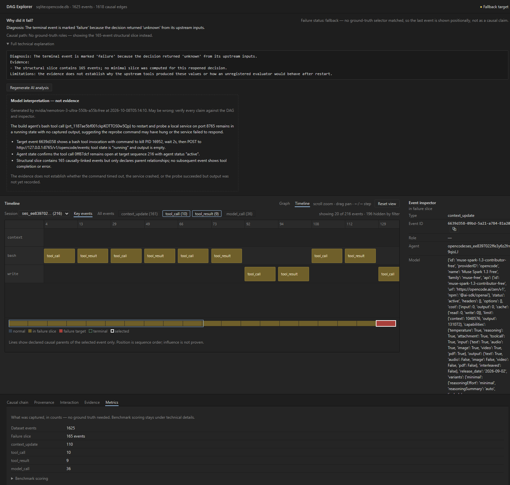
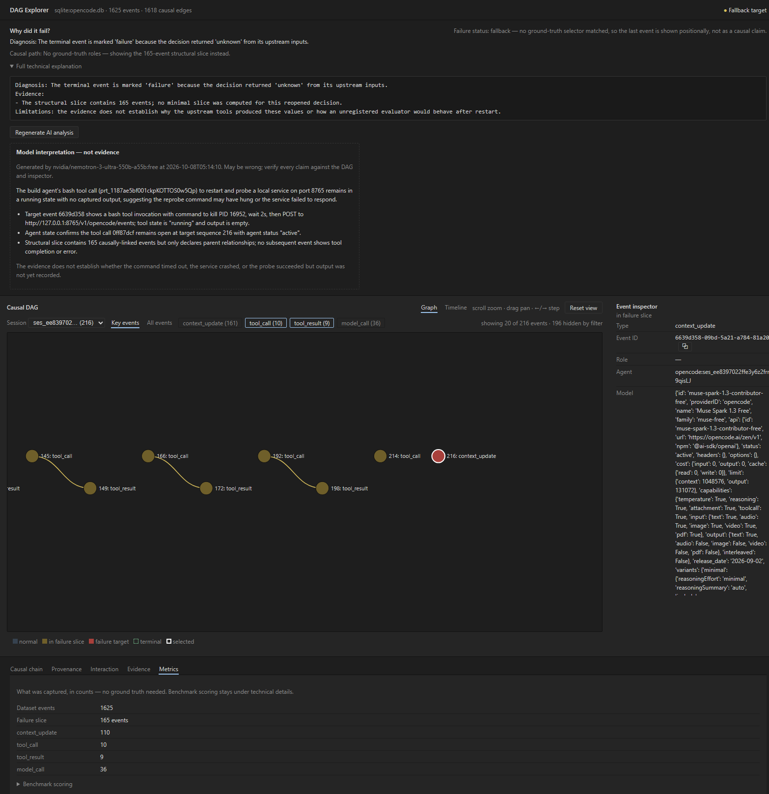

# Verification and Acceptance Procedures

> This phase-oriented acceptance guide is retained for detailed database and
> analytical verification. For current onboarding, commands, and the runnable
> demo, use [README.md](README.md) and [GETTING_STARTED.md](GETTING_STARTED.md).

Run the checks first:

```powershell
uv sync
.\scripts\check.ps1
```

## Benchmark verification

The benchmark phase is deliberately separate from normal unit testing and is
fully offline unless `--provider fastino` is passed. The fixture control is a
real SQLite capture/reopen regression, not a fixture graph self-comparison:

```powershell
uv run pytest tests/integration/test_customer_approval.py -q
uv run casuality-benchmark failure-injection
uv run casuality-benchmark scenarios
uv run casuality-benchmark experiment1 --repetitions 3
uv run casuality-benchmark experiment2 --dependencies 100
uv run casuality-benchmark experiment3
uv run casuality-benchmark baseline
```

`baseline` invokes `clay-good/agent-replay` at the pinned commit
`ccda6229a9451692fb6f1d6d323dd825c2be9dbb` once for each of the five
scenarios. It records the real `ingest`, `list`, and `diff` commands and scores
only divergence localization. Causal interactions, resource dependencies,
distractor reasoning, and minimal reduction remain explicitly unsupported.

The commands write machine-readable JSON and Markdown to `benchmark/results/`.
`experiment1.json` contains temperature/repetition interaction detections and
target evaluation; `experiment2.json` contains automatic memory/file resource
dependency recovery; `experiment3.json` contains each prompt-format intervention
failure category. Thresholds in the research memo remain hypotheses until a
stored result measures them. Fastino is opt-in: set `FASTINO_API_KEY` and
`FASTINO_MODEL`, optionally `FASTINO_BASE_URL` (default `https://api.fastino.ai/v1`), then add `--provider fastino`.
The JSONL response cache prevents an identical provider/model/prompt/config
request from being regenerated.

Most tests run locally against SQLite or the fixture and need no database.
PostgreSQL integration tests use the `DATABASE_URL` from `.env` when it is
set, and are skipped otherwise. They create the schema if needed and leave
test rows behind, so use a dedicated PostgreSQL database.

The queries below can be run in any PostgreSQL SQL client. They do not modify
data. Because each test run uses generated UUIDs, the queries select the
latest run by `started_at` instead of hard-coding IDs.

## 1. Confirm the Phase 2 tables exist

Purpose: verifies that the existing Phase 1 schema and the Phase 2
`snapshots` table were created.

```sql
SELECT table_name
FROM information_schema.tables
WHERE table_schema = 'public'
  AND table_name IN ('runs', 'agents', 'events', 'snapshots')
ORDER BY table_name;
```

Expected result: four rows: `agents`, `events`, `runs`, and `snapshots`.

## 2. Inspect the required column types

Purpose: confirms that IDs use UUIDs, causal parents remain a PostgreSQL UUID
array, event payloads use JSONB, and snapshot state uses JSONB.

```sql
SELECT table_name, column_name, udt_name
FROM information_schema.columns
WHERE table_schema = 'public'
  AND table_name IN ('runs', 'agents', 'events', 'snapshots')
ORDER BY table_name, ordinal_position;
```

Expected result: the required Phase 2 columns are present. In particular:

- `events.id`, `events.run_id`, `events.agent_id` are `uuid`;
- `events.causal_parent_ids` is `_uuid` (PostgreSQL’s `uuid[]` type);
- `events.payload` and `snapshots.state` are `jsonb`;
- `snapshots.state_hash` is `text`.

## 3. Confirm indexes and relationships

Purpose: verifies the indexes used for event ordering, run queries, snapshots,
and retry idempotency.

```sql
SELECT indexname, indexdef
FROM pg_indexes
WHERE schemaname = 'public'
  AND indexname IN (
    'idx_events_agent_seq',
    'idx_events_run_seq',
    'idx_snapshots_agent_seq',
    'idx_events_idempotency'
  )
ORDER BY indexname;
```

Expected result: four rows with those index names.

Purpose: verifies the foreign keys, including
`agents.spawned_at_event_id -> events.id`.

```sql
SELECT
  kcu.table_name,
  kcu.column_name,
  ccu.table_name AS referenced_table,
  ccu.column_name AS referenced_column
FROM information_schema.table_constraints tc
JOIN information_schema.key_column_usage kcu
  ON tc.constraint_name = kcu.constraint_name
 AND tc.table_schema = kcu.table_schema
JOIN information_schema.constraint_column_usage ccu
  ON tc.constraint_name = ccu.constraint_name
 AND tc.table_schema = ccu.table_schema
WHERE tc.table_schema = 'public'
  AND tc.constraint_type = 'FOREIGN KEY'
ORDER BY kcu.table_name, kcu.column_name;
```

Expected result includes these relationships:

- `agents.run_id -> runs.id`;
- `agents.parent_agent_id -> agents.id`;
- `agents.spawned_at_event_id -> events.id`;
- `events.run_id -> runs.id`;
- `events.agent_id -> agents.id`;
- `snapshots.run_id -> runs.id`;
- `snapshots.agent_id -> agents.id`.

## 4. Find the latest test runs

Purpose: identifies the rows created by the Phase 1 and Phase 2 integration
tests without assuming fixed UUIDs.

```sql
SELECT
  r.id AS run_id,
  r.name,
  r.started_at,
  COUNT(DISTINCT a.id) AS agents,
  COUNT(DISTINCT e.id) AS events
FROM runs r
LEFT JOIN agents a ON a.run_id = r.id
LEFT JOIN events e ON e.run_id = r.id
WHERE r.name IN ('phase-1', 'phase-2', 'sequence')
GROUP BY r.id, r.name, r.started_at
ORDER BY r.started_at DESC;
```

Expected result for a fresh complete run:

- `phase-1`: 3 agents and 7 events;
- `phase-2`: 3 agents and at least 9 events;
- `sequence`: 1 agent and 2 events.

The Phase 2 test also creates a shared-ancestor branch, so its event count is
higher than the minimum nine.

## 5. Confirm planner-to-worker relationships

Purpose: verifies that the planner owns both workers and each worker stores
the exact event that spawned it in `spawned_at_event_id`.

```sql
WITH latest_phase2 AS (
  SELECT id
  FROM runs
  WHERE name = 'phase-2'
  ORDER BY started_at DESC
  LIMIT 1
)
SELECT
  a.id,
  a.role,
  a.parent_agent_id,
  a.spawned_at_event_id,
  spawn.event_type AS spawned_event_type,
  a.lamport_offset
FROM agents a
JOIN latest_phase2 r ON r.id = a.run_id
LEFT JOIN events spawn ON spawn.id = a.spawned_at_event_id
ORDER BY a.role, a.created_at;
```

Expected result: one `planner`, one `researcher`, and one `coder`.
The planner has null parent/spawn fields. Both workers reference the planner,
have non-null `spawned_at_event_id`, and their referenced event type is
`agent_spawn`.

## 6. Inspect the real event branches

Purpose: confirms that the worker branches contain model, tool-call, and
tool-result events, and that the result points to its tool call through
`causal_parent_ids`.

```sql
WITH latest_phase2 AS (
  SELECT id
  FROM runs
  WHERE name = 'phase-2'
  ORDER BY started_at DESC
  LIMIT 1
)
SELECT
  a.role,
  e.id,
  e.logical_seq,
  e.event_type,
  e.causal_parent_ids,
  e.payload
FROM events e
JOIN agents a ON a.id = e.agent_id
JOIN latest_phase2 r ON r.id = e.run_id
ORDER BY a.role, e.logical_seq, e.id;
```

Expected result: the `researcher` and `coder` branches each contain
`model_call -> tool_call -> tool_result`. The worker model calls reference
their spawn events, tool calls reference the model calls, and tool results
reference the tool calls. The planner contains two spawn events and a merge
event.

## 7. Confirm the planner merge has both worker results as parents

Purpose: verifies explicit cross-agent causal assignment and multiple parent
support. This checks actual parent rows rather than just counting array items.

```sql
WITH latest_phase2 AS (
  SELECT id
  FROM runs
  WHERE name = 'phase-2'
  ORDER BY started_at DESC
  LIMIT 1
), merge_event AS (
  SELECT e.*
  FROM events e
  JOIN latest_phase2 r ON r.id = e.run_id
  JOIN agents a ON a.id = e.agent_id
  WHERE a.role = 'planner'
    AND e.event_type = 'model_call'
  ORDER BY e.logical_seq DESC
  LIMIT 1
)
SELECT
  m.id AS merge_event_id,
  m.logical_seq AS merge_logical_seq,
  p.id AS parent_event_id,
  pa.role AS parent_role,
  p.event_type AS parent_event_type,
  p.logical_seq AS parent_logical_seq
FROM merge_event m
CROSS JOIN LATERAL unnest(m.causal_parent_ids) AS parents(parent_id)
JOIN events p ON p.id = parents.parent_id
JOIN agents pa ON pa.id = p.agent_id
ORDER BY pa.role;
```

Expected result: two rows for one merge event. The parent roles are
`researcher` and `coder`, and both parent event types are `tool_result`.
The merge’s `causal_parent_ids` are the real worker result IDs.

## 8. Query all ancestors of the merge event

Purpose: runs the production PostgreSQL recursive query. It must include the
merge event itself and every event reachable through its causal parents.

```sql
WITH RECURSIVE latest_phase2 AS (
  SELECT id
  FROM runs
  WHERE name = 'phase-2'
  ORDER BY started_at DESC
  LIMIT 1
), target AS (
  SELECT e.id, e.agent_id, e.logical_seq, e.causal_parent_ids
  FROM events e
  JOIN latest_phase2 r ON r.id = e.run_id
  JOIN agents a ON a.id = e.agent_id
  WHERE a.role = 'planner'
    AND e.event_type = 'model_call'
  ORDER BY e.logical_seq DESC
  LIMIT 1
), ancestors AS (
  SELECT id, agent_id, logical_seq, causal_parent_ids
  FROM target

  UNION

  SELECT e.id, e.agent_id, e.logical_seq, e.causal_parent_ids
  FROM events e
  JOIN ancestors a ON e.id = ANY(a.causal_parent_ids)
)
SELECT
  a.id,
  agents.role,
  a.logical_seq,
  a.causal_parent_ids
FROM ancestors a
JOIN agents ON agents.id = a.agent_id
ORDER BY a.logical_seq, a.id;
```

Expected result: the merge event, both worker result branches, and the spawn
events reached through the worker model-call parents. No unrelated `sequence`
run or other agent appears.

## 9. Confirm shared ancestors are deduplicated

Purpose: verifies that two reachable paths to the same event return that event
once, not once per path.

```sql
WITH RECURSIVE latest_phase2 AS (
  SELECT id
  FROM runs
  WHERE name = 'phase-2'
  ORDER BY started_at DESC
  LIMIT 1
), target AS (
  SELECT e.id, e.causal_parent_ids
  FROM events e
  JOIN latest_phase2 r ON r.id = e.run_id
  WHERE e.payload->>'shared_merge' = 'true'
  LIMIT 1
), ancestors AS (
  SELECT id, causal_parent_ids FROM target
  UNION
  SELECT e.id, e.causal_parent_ids
  FROM events e
  JOIN ancestors a ON e.id = ANY(a.causal_parent_ids)
)
SELECT
  COUNT(*) AS ancestor_count,
  COUNT(DISTINCT id) AS distinct_ancestor_count
FROM ancestors;
```

Expected result: one row with `ancestor_count = 4` and
`distinct_ancestor_count = 4` for the shared-ancestor branch
(`shared_merge`, `left`, `right`, and the shared `root`). The equal counts
confirm that `UNION` prevented the shared root from appearing twice.

## 10. Confirm every causal parent exists

Purpose: checks that every stored causal-parent UUID resolves to an event.

```sql
SELECT
  child.id AS child_event_id,
  parent_id,
  child.causal_parent_ids
FROM events child
CROSS JOIN LATERAL unnest(child.causal_parent_ids) AS parents(parent_id)
LEFT JOIN events parent ON parent.id = parents.parent_id
WHERE parent.id IS NULL;
```

Expected result: no rows. Any row indicates a dangling causal dependency.

## 11. Confirm no duplicate logical sequences within an agent

Purpose: checks the critical ordering invariant. Logical sequences may match
across different agents, but cannot collide within one agent.

```sql
SELECT agent_id, logical_seq, COUNT(*)
FROM events
GROUP BY agent_id, logical_seq
HAVING COUNT(*) > 1;
```

Expected result: no rows.

Logical sequence numbers are ordering values, not causal edges. Use
`causal_parent_ids` and the ancestor query for dependency relationships.

## 12. Confirm snapshots are only written by Phase 3

Purpose: confirms the `snapshots` table stays empty for Phase 1 and Phase 2
tests. Only the Phase 3 integration test creates snapshot rows.

```sql
SELECT COUNT(*) AS snapshots
FROM snapshots;
```

Expected result: `0` if you have run only the Phase 1 and Phase 2
integration tests. After running the Phase 3 integration test (section 13),
expect one snapshot row per captured worker agent; existing rows are not an
error.

---

# Phase 3 testing

Phase 3 adds state reconstruction (`core/reducer.py`), interval snapshots
(`core/snapshots.py`), and structural slicing with decision evidence
(`core/slicing.py`). The sections below cover every testing layer, from the
one-command script down to manual SQL verification of the snapshot rows.

## 13. Run all Phase 3 checks in one command

Purpose: runs every validation layer in order and fails loudly on the first
broken layer. This is the fastest way to confirm a checkout is healthy.

```powershell
powershell -ExecutionPolicy Bypass -File scripts\test_phase3.ps1
```

Skip the database layer when you do not want to touch PostgreSQL:

```powershell
powershell -ExecutionPolicy Bypass -File scripts\test_phase3.ps1 -SkipIntegration
```

Expected result: exit code `0` and `All Phase 3 checks passed.` The script
runs these layers in order:

| Layer | What runs | Expected |
|---|---|---|
| 1 | Phase 3 unit and property tests (section 14) | all selected tests pass |
| 2 | Full unit suite, integration auto-skipped | all applicable tests pass or skip intentionally |
| 3 | `ruff check .` and `ty check .` | clean |
| 4 | Fixture acceptance through the real CLI (section 15) | all assertions hold |
| 5 | Real PostgreSQL integration tests (section 16) | all selected tests pass |

Layer 5 loads `DATABASE_URL` from `.env` and retries once. A failure that
appears only with a hosted database may be connectivity-related; rerun it against
a stable local PostgreSQL instance before changing code.

## 14. Run the Phase 3 test files individually

Purpose: isolates a failing layer without running the whole script.

```powershell
uv run pytest tests/test_reducer.py -q      # reducer + snapshot property tests
uv run pytest tests/test_slicing.py -q     # fixture contract: slice/why/deep_get
uv run pytest tests/test_cli.py -q         # CLI smoke tests
uv run pytest tests/test_postgres_integration.py -m integration -q   # real DB
```

Expected results:

- `test_reducer.py`: all selected tests pass, including replay stability,
  unrelated-event isolation, causal-parent validation, and snapshot/replay
  equality.
- `test_slicing.py`: `structural_slice(A4)` returns exactly the nine fixture
  events, excludes agent D, prefers the recursive SQL path when the store
  provides `ancestors`, survives cyclic parents, and resolves decision ports
  against recorded payloads.
- `test_cli.py`: all selected CLI tests pass.
- The integration file passes when `DATABASE_URL` points to PostgreSQL and
  self-skips otherwise.

## 15. Try the debugger against the fixture, no database

Purpose: exercises the real CLI end to end using `fixture.json` as the event
store. These are the same assertions layer 4 of the script makes.

```powershell
uv run casuality --fixture fixture/fixture.json agents
uv run casuality --fixture fixture/fixture.json slice A4
uv run casuality --fixture fixture/fixture.json why A3
uv run casuality --fixture fixture/fixture.json reconstruct B 4
```

Expected results:

- `agents` lists `A planner`, `B researcher`, `C coder`,
  `D background_monitor`.
- `slice A4` prints `Structural slice of A4: 9 events (python_bfs)` followed
  by `A1, B1, C1, B2, C2, B3, C3, A3, A4`. No `D*` event appears, matching
  the fixture's ground-truth `structural_slice`.
- `why A3` prints JSON with `contract_present: false` (the plain fixture
  carries no embedded contract) and `declared_inputs` naming `B3` from agent
  B and `C3` from agent C, plus the note that this is structural evidence
  only, not proven influence.
- `reconstruct B 4` prints `status=active`, a SHA-256 state hash, and JSON
  where `tool_outputs.B2` equals `{"customer_status":"eligible"}` — proof the
  recorded tool result folded into reconstructed state.

Against a live run, swap the backend for PostgreSQL:

```powershell
uv run casuality slice <event-uuid>
```

## 16. Confirm the Phase 3 integration test wrote valid snapshots

Purpose: verifies, directly in SQL, what the integration test claims: one
interval snapshot per worker at `logical_seq = 32` (the first multiple of
32 reached), a full 64-hex-character hash, and a state blob holding the 32
memory keys written before that point.

Run the integration tests first so fresh rows exist:

```powershell
Get-Content .env | ForEach-Object {
  $p = $_ -split '=', 2
  if ($p.Length -eq 2) { [Environment]::SetEnvironmentVariable($p[0], $p[1], 'Process') }
}
uv run pytest tests/test_postgres_integration.py -m integration -q
```

Then inspect the result in your PostgreSQL SQL client:

```sql
WITH latest_phase3 AS (
  SELECT id
  FROM runs
  WHERE name = 'phase-3'
  ORDER BY started_at DESC
  LIMIT 1
)
SELECT
  a.role,
  s.logical_seq,
  s.state_hash ~ '^[0-9a-f]{64}$' AS hash_is_sha256_hex,
  (SELECT COUNT(*)
   FROM jsonb_object_keys(s.state->'memory') AS k) AS memory_keys,
  s.state->>'status' AS status,
  (SELECT COUNT(*)
   FROM jsonb_object_keys(s.state->'open_tools') AS t) AS open_tools_count
FROM snapshots s
JOIN latest_phase3 r ON r.id = s.run_id
JOIN agents a ON a.id = s.agent_id
ORDER BY s.created_at DESC;
```

Expected result: one row for the `worker` role with `logical_seq = 32`,
`hash_is_sha256_hex = true`, `memory_keys = 32`, `status = active`, and
`open_tools_count = 0`. The unrelated `outsider` agent has no snapshot row:
it never reaches the 32-event interval boundary, exactly as the policy
prescribes.

## 17. Verify reconstruction agrees with the stored snapshot

Purpose: proves against live PostgreSQL rows that the reducer's integrity
rule from thesis section 30.3 holds end to end. The maintained integration
test performs exactly this check, so run it rather than hand-writing SQL:

```powershell
uv run pytest "tests/test_postgres_integration.py::test_phase3_reconstruction_snapshots_and_sql_slice_against_postgres" -m integration -v
```

Expected result: the selected test passes. It verifies three things against
real rows:

- the snapshot-shortcut replay equals a from-scratch replay byte for byte
  (`canonical_json` equality);
- `verify_snapshot` accepts an untampered snapshot at its own sequence;
- the recursive SQL slice of the merge event contains its two declared
  parents while excluding the unrelated outsider event.

---

# Phase 4 testing

Phase 4 adds field-level provenance (`core/provenance.py`), grade-attributed
traversal (`exact` vs `coarse`), automatic capture via `@capture_tool`, and
PostgreSQL-backed recursive CTE queries. Sections below cover the unit tests,
CLI exercises, and SQL verification.

## 18. Run the Phase 4 test file

Purpose: runs the full provenance test suite in isolation.

```powershell
uv run pytest tests/test_provenance.py -v
```

Expected result: all local provenance tests pass. The PostgreSQL integration
test self-skips unless `DATABASE_URL` is set.

The selected tests cover:

| Test | What it verifies |
|---|---|
| `test_provenance_decision_input_returns_exact_fixture_edges` | `provenance("A3.output.approve")` returns exactly 4 exact edges tracing back to tool invocations; 0 coarse edges. |
| `test_provenance_llm_boundary_halts_at_coarse_grade` | `provenance("B2.args.query")` returns 1 coarse edge and halts; traversal does not cross the LLM boundary. |
| `test_provenance_full_chain_from_final_answer` | Full multi-hop exact chain from `A4.final_answer` resolves without duplicates. |
| `test_coarse_edge_cannot_have_source_path` | `ProvenanceEdge(grade="coarse", source_path="x")` raises `ValueError` enforcing the grade invariant. |
| `test_provenance_cycle_detection` | Circular exact edges terminate cleanly; no infinite loop. |
| `test_provenance_diamond_graph_deduplication` | A diamond (A → B, A → C, B → D, C → D) visits D exactly once. |
| `test_record_tool_result_provenance_helper` | Helper emits exact edges tagged `tool_call` per `field_sources` mapping. |
| `test_record_model_call_provenance_helper` | Helper emits coarse edges with `source_path=None` for each downstream field. |
| `test_record_memory_write_provenance_helper` | Helper emits an exact edge for a memory write with `source_path` set. |
| `test_capture_tool_with_field_sources_decorator` | `@capture_tool(field_sources=…)` automatically persists provenance on tool completion. |
| `test_verify_chunk_sensitivity` | `verify_chunk_sensitivity` returns `True` when perturbing a chunk changes the model call output. |
| `test_cli_provenance_command_renders_grades` | CLI `provenance` command output contains `[exact]` and `[coarse]` strings. |

## 19. Run the full suite and confirm no regressions

Purpose: confirms Phase 4 does not break Phases 1–3.

```powershell
uv run pytest -q
```

Expected result: the full suite passes. PostgreSQL integration tests may
self-skip when `DATABASE_URL` is not configured.

Static analysis must also be clean:

```powershell
uv run ruff check .
uv run ty check .
```

Expected result: `All checks passed!` for both.

## 20. Try the provenance CLI against the fixture, no database

Purpose: exercises the `provenance` subcommand end to end against the bundled
`fixture.json`. No database is required.

```powershell
# Trace an exact multi-hop chain
uv run casuality --fixture fixture/fixture.json provenance A3.output.approve

# Trace an LLM-boundary coarse link
uv run casuality --fixture fixture/fixture.json provenance B2.args.query
```

Expected results:

- `provenance A3.output.approve` prints a chain of the form:

  ```text
  Provenance chain for A3.output.approve:
    A3.output.approve <- output.customer_status [exact] via policy_check_v2 (from event B3)
    A3.output.approve <- output.risk_score [exact] via policy_check_v2 (from event C3)
    B3.output.customer_status <- ... [exact] via tool_call (from event B2)
    C3.output.risk_score <- ... [exact] via tool_call (from event C2)
  ```

  All edges are `[exact]`; no coarse boundary appears. Four edges total.

- `provenance B2.args.query` prints a single coarse edge:

  ```text
  Provenance chain for B2.args.query:
    B2.args.query <- event:B1 [coarse] (LLM boundary, halts)
  ```

  Traversal halts at the LLM boundary and does not recurse further.

## 20a. Try the provenance CLI against a live PostgreSQL database

Purpose: same assertions as §20 but against real persisted provenance edges in
the database. Run the integration test first so provenance rows exist, then
query the CLI using `--db` or `--fixture` to point at a database.

**Step 1 — seed the database:**

```powershell
Get-Content .env | ForEach-Object {
  $p = $_ -split '=', 2
  if ($p.Length -eq 2) { [Environment]::SetEnvironmentVariable($p[0], $p[1], 'Process') }
}
uv run pytest tests/test_provenance.py::test_postgres_provenance_storage_and_recursive_query -v
```

Expected: the selected integration test passes. It seeds `provenance_edges`
rows with `field_path = "agent.decision.output"` and
`field_path = "agent.tool.result"`.

**Step 2 — query the CLI against the database:**

```powershell
# Trace the chain rooted at agent.decision.output (uses DATABASE_URL automatically)
uv run casuality provenance agent.decision.output
```

Expected result: a chain of the form:

```text
Provenance chain for agent.decision.output:
  agent.decision.output <- agent.tool.result [exact] via tool_call (from event <uuid>)
```

The `[exact]` grade confirms the edge was persisted with `grade = 'exact'`
and `source_path` pointing back to the tool result field.

**Step 3 — confirm traversal stays in one run:**

```powershell
uv run casuality provenance agent.decision.output
```

If the integration test has been run multiple times, each run's edges share
the same `field_path`. Only edges from a single run should appear in the
chain. Verify by checking the `(from event <uuid>)` references all resolve
to events inside the same run in the database.

> [!NOTE]
> The database backend resolves `DATABASE_URL` from the environment. If you
> have not set it, the CLI defaults to a local SQLite database at
> `.casuality/events.db` instead of failing.


## 21. Confirm the Phase 4 schema exists

Purpose: verifies that `provenance_edges` table and the `provenance_grade`
enum were created.

```sql
SELECT table_name
FROM information_schema.tables
WHERE table_schema = 'public'
  AND table_name = 'provenance_edges';
```

Expected result: one row, `provenance_edges`.

```sql
SELECT typname, enumlabel
FROM pg_enum e
JOIN pg_type t ON t.oid = e.enumtypid
WHERE t.typname = 'provenance_grade'
ORDER BY e.enumsortorder;
```

Expected result: two rows — `exact` and `coarse`.

## 22. Confirm Phase 4 indexes and foreign keys

Purpose: verifies that the provenance performance indexes and the FK to
`events(id)` were created.

```sql
SELECT indexname, indexdef
FROM pg_indexes
WHERE schemaname = 'public'
  AND indexname IN (
    'idx_provenance_field',
    'idx_provenance_source'
  )
ORDER BY indexname;
```

Expected result: two rows — `idx_provenance_field` and `idx_provenance_source`.

```sql
SELECT
  kcu.table_name,
  kcu.column_name,
  ccu.table_name AS referenced_table,
  ccu.column_name AS referenced_column
FROM information_schema.table_constraints tc
JOIN information_schema.key_column_usage kcu
  ON tc.constraint_name = kcu.constraint_name
JOIN information_schema.constraint_column_usage ccu
  ON tc.constraint_name = ccu.constraint_name
WHERE tc.table_schema = 'public'
  AND tc.constraint_type = 'FOREIGN KEY'
  AND kcu.table_name = 'provenance_edges'
ORDER BY kcu.column_name;
```

Expected result includes:

- `provenance_edges.run_id → runs.id`
- `provenance_edges.source_event_id → events.id`

## 23. Inspect stored provenance edges after a real run

Purpose: confirms that the integration test wrote valid provenance rows.

Run the integration test first:

```powershell
Get-Content .env | ForEach-Object {
  $p = $_ -split '=', 2
  if ($p.Length -eq 2) { [Environment]::SetEnvironmentVariable($p[0], $p[1], 'Process') }
}
uv run pytest tests/test_provenance.py::test_postgres_provenance_storage_and_recursive_query -v
```

Then inspect the result in your PostgreSQL SQL client:

```sql
SELECT
  field_path,
  source_event_id,
  source_path,
  grade,
  transform
FROM provenance_edges
ORDER BY created_at DESC
LIMIT 10;
```

Expected result: rows where:

- `grade` is `exact` for tool result and memory write edges;
- `grade` is `coarse` for model call output edges, with `source_path = NULL`;
- `transform` reflects the capture context (`tool_call`, `memory_write`,
  or `model_call`).

## 24. Verify run isolation in the recursive provenance query

Purpose: confirms that `query_provenance_chain` does not leak edges across
runs when two runs contain the same `field_path`.

```sql
-- Count how many distinct run_ids appear in a provenance chain query.
-- Any run_id other than the target run indicates a cross-run leak.
WITH RECURSIVE prov_cte AS (
  SELECT pe.id, pe.run_id, pe.field_path, pe.source_event_id, pe.source_path,
         pe.grade, 1 AS depth
  FROM provenance_edges pe
  WHERE pe.field_path = 'agent.decision.output'
  ORDER BY pe.created_at DESC
  LIMIT 1
  UNION ALL
  SELECT p.id, p.run_id, p.field_path, p.source_event_id, p.source_path,
         p.grade, c.depth + 1
  FROM provenance_edges p
  INNER JOIN prov_cte c
      ON p.field_path = c.source_path
     AND p.run_id = c.run_id
  WHERE c.grade = 'exact' AND c.source_path IS NOT NULL AND c.depth < 50
)
SELECT COUNT(DISTINCT run_id) AS distinct_runs
FROM prov_cte;
```

Expected result: `distinct_runs = 1`. Any value greater than 1 means a
cross-run boundary was crossed and the `AND p.run_id = c.run_id` join
condition is missing or broken.

---

## 25. Verify Phase 5: Counterfactual Replay, Interaction Attribution & Minimal Slicing

Purpose: confirms that the decision SCM replay engine evaluates semantic port substitutions, prevents dangerous side effects, minimizes structural slices using delta debugging, and computes Shapley-Owen interaction indices.

### Automated Test Suite Execution
```powershell
uv run pytest tests/test_replay.py -v
```

Expected result: the selected replay, attribution, and minimization tests pass,
verifying:
- Port baseline substitution (`do(Port_i = baseline)`).
- Side-effect safety enforcement (`ReplayUnsafe` exception thrown when tool is marked side-effecting).
- Shapley values $\phi_i$ and pairwise interaction index $I_{ij}$ with bootstrap standard errors.
- Minimal slice `ddmin` reduction on the customer approval scenario from 9 events to 4 events (`B3`, `C3`, `A3`, `A4`).

### CLI Verification Against Fixture
```powershell
# 1. Evaluate single counterfactual intervention
uv run casuality --fixture fixture/fixture.json replay dec_customer_approval_A3 customer_status=ineligible
# Expected: Original outcome: failure, Counterfactual outcome: success

# 2. Compute Shapley interaction index
uv run casuality --fixture fixture/fixture.json interaction dec_customer_approval_A3
# Expected: B3_x_C3 interaction value = 1.0, std_err = 0.0

# 3. Minimize structural slice via ddmin
uv run casuality --fixture fixture/fixture.json minimize A4
# Expected: Minimal slice of A4: 4 events (ddmin) -> B3, C3, A3, A4
```

---

## 26. Verify Phase 6: Grounded Causal Explanation

Purpose: verifies that `build_evidence_package` aggregates all structural, reconstructive, provenance, and interaction evidence into a unified package, and that `explain` generates faithful explanations using OpenRouter (`qwen/qwen3.8-27b:free`).

### Automated Test Suite Execution
```powershell
uv run pytest tests/test_explain.py -v
```

Expected result: the focused suite verifies:
- Complete evidence package assembly for failure `A4` (structural slice, minimal slice, provenance chains, Shapley interaction, agent state).
- Fallback for events without decision contracts (`D3`).
- Error handling when `OPENROUTER_API_KEY` is missing.
- Mock HTTP transport verifying system prompt grounding principles (citing event IDs, distinguishing observations from inferences, noting exact provenance).
- Exponential backoff and retry behavior on HTTP 429 rate limits.
- Alignment with ground-truth acceptance criteria (L776–782).

### CLI Verification (Offline & Zero-Token)
```powershell
uv run casuality --fixture fixture/fixture.json explain A4 --no-llm --raw-evidence
```

Expected result:
- Full structured JSON containing `target_event`, `structural_slice` (9 events), `minimal_slice` (4 events: `B3`, `C3`, `A3`, `A4`), `interaction_attribution` ($B3 \times C3 = 1.0$), and exact fixture `provenance`.
- A plain-text summary with `Diagnosis:`, `Evidence:`, and `Limitations:` sections. The tested-chain line names the semantic inputs and reports four events; the interaction line names `customer_status` and `risk_score` without Python list formatting.

### Live Explanation with OpenRouter
```powershell
# Using default Qwen 3.8 27B model (or override via --model)
uv run casuality --fixture fixture/fixture.json explain A4
```

Expected result:
- A bounded explanation with `Diagnosis:`, `Evidence:`, and `Limitations:` sections.
- The semantic ports `customer_status` and `risk_score` are named, and readable fixture event IDs are cited when useful.
- The non-linear joint interaction between customer eligibility and risk is identified without claiming that structural ancestry alone proves influence.
- Exact and coarse provenance boundaries remain explicit.

---

## 27. End-to-End Real-World Scenario Testing Guide

How to test the Causal Debugger against real multi-agent pipelines in production or staging environments:

### Step 1: Verify PostgreSQL Connection and Schema
Make sure `DATABASE_URL` is set in `.env`:
```powershell
Get-Content .env | Select-String "DATABASE_URL"
```

Verify table creation and connectivity:
```sql
SELECT count(*) FROM runs;
SELECT count(*) FROM events;
```

### Step 2: Instrument an Actual Multi-Agent Script
Write a test runner script (e.g. `run_real_scenario.py`) using the SDK components:
1. `PostgresEventStore`: writes immutable events to PostgreSQL with Lamport sequence numbers.
2. `spawn_agent`: sets up parent-child relationships and propagates logical clocks.
3. `@capture_tool`: decorates deterministic or API tools and declares `field_sources` for field-level provenance tracking.
4. `CapturedMemory`: ensures all shared state mutations are automatically stamped with the Resource-Version Invariant, auto-injecting causal parents on reads.
5. `CapturedClient`: intercepts model calls, logging prompts, completions, and token metrics.
6. `create_decision_contract`: binds converging branch outputs into a formal decision SCM with typed baseline values.

### Step 3: Inject an Interacting Failure
To test multi-branch causal isolation in real life:
- Worker Agent 1 (`researcher`): queries an external search or database, returning a faulty value (e.g. `customer_status = "eligible"` due to a search record collision).
- Worker Agent 2 (`risk_service`): queries an internal risk service, returning a borderline value (e.g. `risk_score = 0.2`).
- Planner Agent 3: merges both values using a policy function (`policy_check_v2`).
- Final Agent 4: finishes with `status = "failure"` (an ineligible customer was approved).

### Step 4: Run the Full Causal Diagnostic Battery via CLI
Query the real PostgreSQL run using the CLI:

```powershell
# 1. Structural slice isolates the causal cone from hundreds of irrelevant events:
uv run casuality slice <failure-event-uuid>

# 2. Audit field-level origins through tools:
uv run casuality provenance <decision-event-uuid>.output.approve

# 3. Minimize down to the minimal failure-inducing subset:
uv run casuality minimize <failure-event-uuid>

# 4. Measure whether failure was Branch 1, Branch 2, or Joint:
uv run casuality interaction <decision-contract-uuid>

# 5. Synthesize grounded explanation:
uv run casuality explain <failure-event-uuid>
```

### Step 5: Verification Checklist for Real Systems
- [ ] **DAG Completeness**: All intra-agent and cross-agent dependencies are connected without disconnected islands (`core.validator.check_intra_agent_continuity`).
- [ ] **Shared Memory Attribution**: Data consumed through a registered `CapturedMemory` resource URI traces back to its latest writer in the same run.
- [ ] **Exact vs. Coarse Honesty**: Values produced by deterministic tools are tagged `exact`; values generated by LLM reasoning boundaries are flagged `coarse`.
- [ ] **Interaction Isolation**: In joint failure modes, the interaction index $I_{ij} \gg 0$ identifies a combination effect rather than attributing the recorded outcome to one input alone.
- [ ] **Explanation Grounding**: The generated diagnosis names semantic inputs, uses readable event IDs when available, avoids unrecorded claims, and explains the joint interaction.

---

## 28. Verify OpenCode Runtime Adapter

Purpose: confirms that the OpenCode plugin adapter captures coding-agent sessions, translates them into the canonical event model without terminal scraping, feeds file reads/writes into the Resource-Version machinery, redacts sensitive tokens, and recovers causal graph ancestors.

### Automated Test Suite Execution

```powershell
uv run pytest tests/test_opencode_adapter.py -v
```

Expected result: all 11 adapter tests pass, verifying:
- **Event Mappings**: Translates `session.created` → `run_start`, `session.deleted` → `run_finish`, `session.error` → `agent_error`, `session.status`/`diff` → `context_update`, `message.updated` → `model_call`, `file.edited` → `tool_result`, `command.executed` → `tool_call`, `tool.execute.before/after` → `tool_call`/`tool_result`, `permission.ask` → `tool_call`.
- **Fail-Open Resilience**: Disk/storage exceptions in the event log or malformed HTTP payloads to `/v1/opencode/events` return HTTP 202 without crashing or interrupting OpenCode.
- **Resource Causality**: File writes registered via `file.edited` establish versioning in `ResourceRegistry`; subsequent tool calls reading the file auto-inject the writer event ID as causal parent.
- **Privacy Redaction**: Recursively strips `authorization`, `Bearer`, `sk-*`, `api_key`, `token`, and `password` values from headers, payloads, and nested arrays before persistence.
- **Timestamp Fidelity**: External OpenCode timestamps persist directly through SQLite rather than being overwritten with ingestion wall times.
- **Deterministic End-to-End Session**: 12-event simulated lifecycle executes through a live HTTP server, persists to SQLite, and produces an unbroken causal ancestor tree from `run_finish` back to `run_start`.

### Real Runtime Smoke Test Procedure

1. Launch receiver daemon in one terminal:
```powershell
uv run casuality-opencode-ingest --db .casuality/opencode.db
```

2. Run real OpenCode session in a second terminal:
```powershell
$env:CASUALITY_OPENCODE_INGEST_URL = "http://127.0.0.1:8765/v1/opencode/events"
opencode run "Inspect the repository, make a small testable change, and run pytest"
```

3. Validate persisted events and DAG connectivity:
```powershell
uv run python -c "
from storage.sqlite import SQLiteEventStore
store = SQLiteEventStore('.casuality/opencode.db')
events = store.events()
print(f'Total captured events: {len(events)}')
tools = [e for e in events if e.event_type in ('tool_call', 'tool_result')]
print(f'Captured tool events: {len(tools)}')
latest = events[-1]
ancestors = store.ancestors(latest.id)
print(f'Causal ancestors leading to latest event ({latest.id}): {len(ancestors)}')
"
```

## 29. Verify the Visual DAG Explorer

Purpose: confirms the read-only explorer (`explorer/`, five evidence endpoints plus opt-in `/api/ai-diagnosis`) and the Next.js frontend render captured traces truthfully — declared edges only, no invented causality — and that all automated gates pass.

### Automated Test Suite Execution

Backend (from repo root):
```powershell
uv run pytest tests/test_explorer.py -q
```

Expected result: all 11 explorer tests pass (endpoint shape, demo byte-identity, AI-diagnosis sections/cache/502/503 mapping).

Frontend (from `frontend/`):
```powershell
npm test
npx tsc --noEmit
npm run build
```

Expected result: `npm test` 130/130 (contract checks for IDs, endpoints, demo shape, pointer-capture ban, shared legend, trace-fact tab bodies, AI quarantine, plus unit tests for selection, viewport, render, inspector, timeline, filter, tracefacts); `tsc` strict clean; `next build` static export succeeds into `frontend/out/`.

Repo-wide gates (from repo root):
```powershell
uv run ruff check .
uv run ty check .
uv run pytest -q
```

Expected result: ruff and ty clean; full suite green (192 passed, 7 skipped — skips are postgres-integration).

### Live-Server Smoke Test Procedure

1. Start the explorer (default serves the bundled 10-envelope demo trace; `--db` points at a live capture):
```powershell
uv run python -m explorer.server --db .casuality/opencode.db --port 8797
```

2. Verify the evidence endpoints (replace `$port` if different):
```powershell
(Invoke-WebRequest http://127.0.0.1:8797/ -UseBasicParsing).StatusCode
(Invoke-RestMethod http://127.0.0.1:8797/api/overview).event_count
(Invoke-RestMethod http://127.0.0.1:8797/api/failure) | Select-Object status, method, is_fallback
(Invoke-RestMethod http://127.0.0.1:8797/api/evidence).status
```

Expected result: index `200`; overview returns the dataset event count; failure reports `resolved` (demo, selector matched) or `fallback_last_event` (live captures without ground truth — shown honestly as "Fallback target", never as a causal claim); evidence `ok`.

3. Verify the opt-in AI endpoint (requires `OPENROUTER_API_KEY` in the environment or repo `.env`; model via `OPENROUTER_MODEL`, otherwise the backend default):
```powershell
(Invoke-RestMethod http://127.0.0.1:8797/api/ai-diagnosis | ConvertTo-Json -Depth 4).Substring(0, 400)
```

Expected result: HTTP `200` with `{status: "ok", model, generated_at, sections: {diagnosis, evidence[], limitations}}`; the interpretation names the failure-relevant tool activity with honest limitations. Without a key expect HTTP `503 ai_unavailable`; on model/format failure expect HTTP `502` (the local template is never passed off as AI output). Repeats are instant (per-dataset in-memory cache).

### Manual UI Checklist (http://127.0.0.1:8797)

1. Header pill reads "Resolved" (demo) or "Fallback target" (live, amber) with an explanatory title — never "failure resolved".
2. "Why did it fail?" shows the one-sentence lede plus clickable role chips (demo) or the slice-size note (live, no ground-truth roles).
3. Graph|Timeline toggle: DAG shows depth-lane nodes with gold ancestor highlight on selection; Timeline shows run/model/context/tool lanes, ruler scrub, playhead, and minimap with viewport rectangle.
4. Filter bar: Key-events preset hides `context_update`/`model_call` streaming noise; the failure node stays pinned visible even when its type is hidden; session picker defaults to latest activity; counter reads "showing X of Y events".
5. Clicking any node/clip updates the inspector (Command + Result heroes for tool events, full field list, copy buttons) — Graph clicks must select, never misfire after a drag (6px drag-vs-click threshold).
6. Tabs: Causal chain lists slice events; Provenance shows per-resource chains (grounded grades when recorded, "Discovered in this trace" chains otherwise); Interaction shows recorded fan-out/fan-in or an honest linear-chain note; Evidence leads with the tool story; Metrics leads with the capture census — benchmark scoring stays collapsed under "Benchmark scoring"/"Technical metric details".
7. "Generate AI analysis" renders a dashed "Model interpretation — not evidence" block with model name and timestamp; nothing AI-related fetches on page load.

Reference states (live 1625-event capture, `ses_ee839702` session, Key events):






