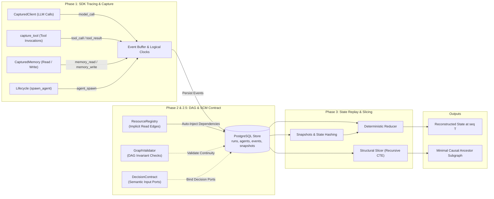

# Agent-Casuality: Architecture & Process (Phases 0 – 3)

This document details the end-to-end architecture and execution flow for **Phase 0 through Phase 3** in Agent-Casuality, covering how events are captured, structured into a causal DAG, validated, reduced, and sliced.

---

## 1. High-Level System Architecture

---

## 2. Step-by-Step Flow: From Ingestion to Causal Slicing

### Phase 1: Transparent Ingestion & Clock Allocation (`sdk/`)
Every agent interaction produces an immutable event record without relying on non-deterministic wall-clock timestamps.

* **Logical Clocks (`sdk/events.py`):**
  Each agent maintains an `AgentClock`. The `next_seq(clock, causal_parents)` function monotonically allocates sequence numbers and tracks Lamport vector ordering.
* **Model Ingestion (`sdk/client.py`):**
  `CapturedClient` wraps LLM API clients (e.g., Anthropic, OpenAI) to capture prompt structures, token outputs, and request latencies as `model_call` events.
* **Tool Invocation Tracing (`sdk/tools.py`):**
  The `@capture_tool` decorator automatically emits linked event pairs: `tool_call` (tagged with a unique `invocation_id`) followed by `tool_result` or `agent_error`.
* **Subagent Lifecycle (`sdk/lifecycle.py`):**
  When a coordinator spawns a subagent, `spawn_agent` explicitly records `parent_agent_id` and `spawned_at_event_id` in the database.
* **Privacy & Redaction (`sdk/privacy.py`):**
  Sensitive keys, credentials, and configured payload patterns are stripped before storage writes.

---

### Phase 2: Relational Multi-Agent DAG (`storage/` & `core/graph.py`)
Persists structured agent activity and establishes explicit cross-agent dependency graphs.

* **Database Schema (`storage/postgres.py`):**
  - `runs`: Session-level metadata and configuration.
  - `agents`: Parent-child hierarchy and spawn event pointers.
  - `events`: Monotonic `logical_seq`, `event_type`, `payload` (JSONB), and `causal_parent_ids` (`uuid[]`).
  - `snapshots`: Periodic state checkpoints and validation hashes.
* **Cross-Agent Dependency Merges (`core/graph.py`):**
  When a planner agent aggregates results from concurrent worker subagents, `assign_causal_parents` attaches the workers' terminal event IDs into the merge event’s `causal_parent_ids`.

---

### Phase 2.5: Decision SCM Contract & Shared State Invariants (`core/decision.py`, `core/validator.py`)
Establishes a formal Structural Causal Model (SCM) boundary over raw event traces.

* **Resource Version Invariants (`sdk/memory.py`):**
  `ResourceRegistry` monitors state URIs (such as `mem://{agent_id}/{key}`). When an agent reads from shared memory, the system automatically injects the latest write event ID into the reader's causal parents.
* **Semantic Input Ports (`core/decision.py`):**
  Maps high-level agent decisions to structured `DecisionContract` schemas containing typed `DecisionPort` inputs with baseline fallback values, enabling controlled counterfactual substitutions ($do(\text{Port}_i = \text{baseline})$).
* **Graph Completeness Validator (`core/validator.py`):**
  Runs graph consistency checks against PostgreSQL:
  - `check_dangling_parents`: Ensures all referenced parent IDs exist in the database.
  - `check_cross_run_isolation`: Confirms causal edges never cross run boundaries.
  - `check_intra_agent_continuity`: Detects missing sequence increments within individual agent timelines.

---

### Phase 3: State Reconstruction & Structural Slicing (`core/reducer.py`, `core/snapshots.py`, `core/slicing.py`)
Provides deterministic historical replay and isolates failure-inducing ancestor subgraphs.

* **Deterministic State Reducer (`core/reducer.py`):**
  Given an `(agent_id, target_seq)` pair, `reconstruct` re-applies event delta transitions sequentially to rebuild the agent's exact internal state (`messages`, `memory`, `tools_called`, and `status`).
* **Snapshots & State Hashing (`core/snapshots.py`):**
  Snapshots taken at regular intervals accelerate replay. Each snapshot stores a deterministic SHA-256 `state_hash` to prove reproducible state transitions.
* **Structural Slicing (`core/slicing.py`):**
  Given a target event $E_{\text{target}}$ (e.g., a fatal exception or incorrect merge), `structural_slice` runs a recursive CTE over `causal_parent_ids` and `spawned_at_event_id` to prune out unrelated concurrent activity, returning **only the causal ancestor subgraph**.

---

## 3. Downstream Capabilities (Phases 4 – 6)

With Phases 0 through 3 complete, the foundation supports:
1. **Phase 4 (Fine-Grained Provenance):** Sub-token and payload field tracking through tool outputs.
2. **Phase 5 (Counterfactual Replay & Delta Debugging):** Active intervention testing and Shapley attribution over semantic decision ports.
3. **Phase 6 (LLM Explainer & Interactive CLI):** Human-readable root-cause explanations synthesized from minimal causal slices.