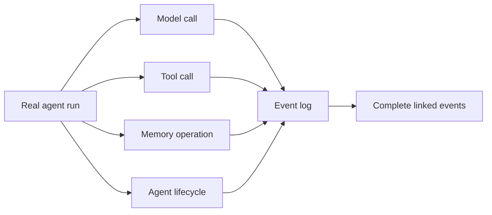
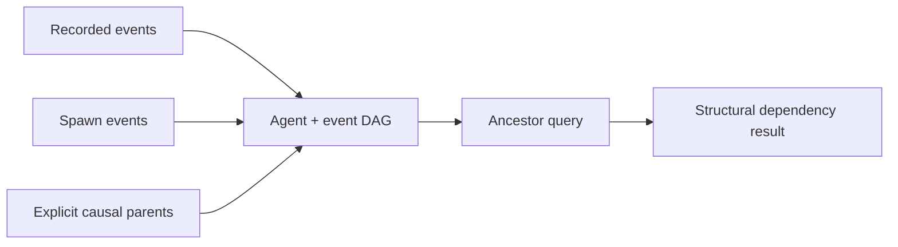
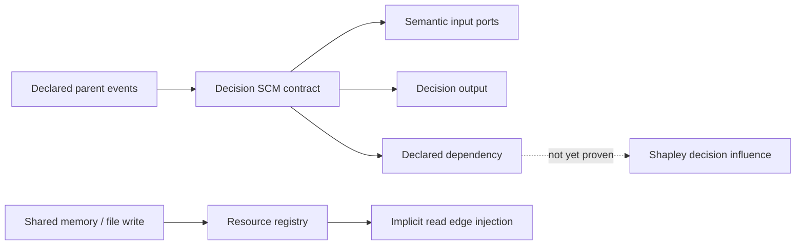
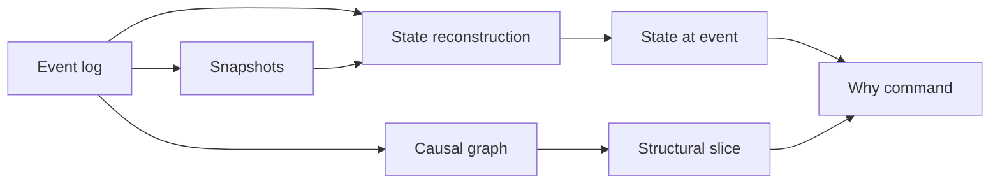
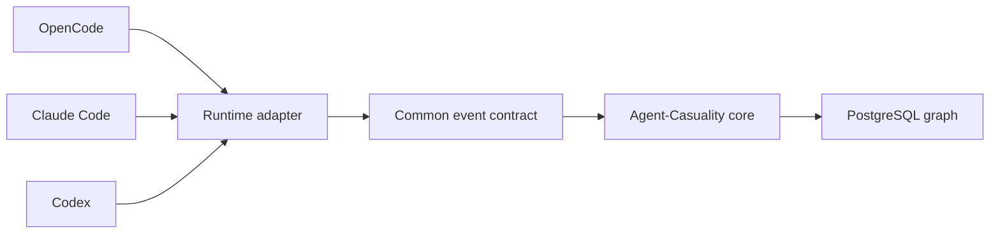
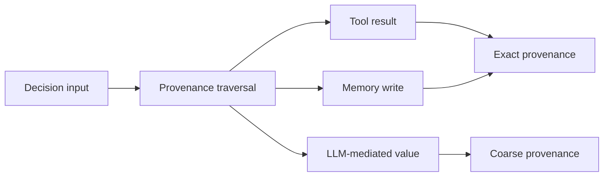
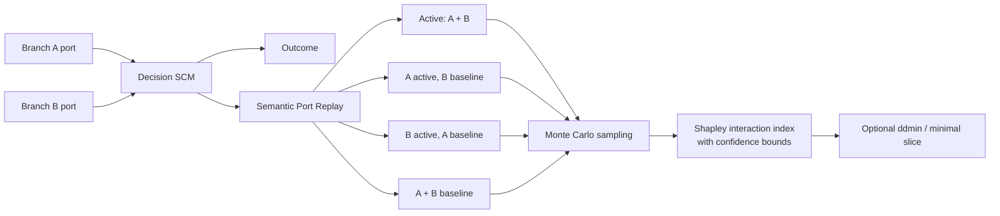
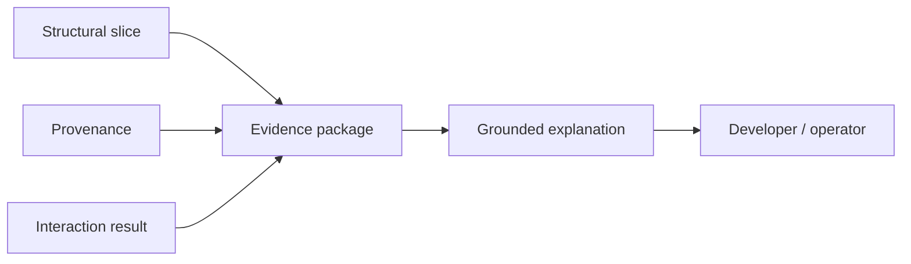

# Causal Debugger, Implementation Guide

## How to use this document

The thesis document (`thesis.md`) explains what this is
and why each piece exists. Section 30 of that document already has the
core algorithms, the schema, the delta debugging code, the counterfactual
replay engine. This document does not repeat that. It answers a different
question: in what order do three people actually build this, who does
what, what has to exist before what, and what does the first real week
look like.

Every phase below has the same shape: goal, why it matters, what needs to
already exist before you start, the concrete tasks, code where it adds
something new beyond section 30, how you know it's actually done, who
owns it, and the mistakes worth avoiding going in.

---

## Prerequisites, whole project

Before anyone writes a line of the real system:

- **Postgres.** Neon works fine and needs no local install, or run
  Postgres locally with Docker if you'd rather not depend on a hosted
  free tier for day to day development.
- **Python 3.11 or newer**, for the capture SDK, the core engine, and the
  CLI.
- **An Anthropic API key**, for the capture SDK to wrap and for the
  explanation layer in phase 6.
- **git**, obviously, with a simple branching approach, `main` plus short
  lived feature branches per phase is enough for three people, nothing
  fancier is needed.
- **pytest**, for the property tests in phase 3 and onward.
- **The fixture files already built**, `fixture/fixture.json` and
  `fixture/mock.py`. Everyone on the team should be able to run
  `uv run python fixture/mock.py agents` and see output before doing
  anything else. That's the actual onboarding check, not a slide deck.

Suggested repository layout, close to what the thesis document already
sketched:

```text
causal-debugger/
├── sdk/
│   ├── client.py          phase 1
│   ├── tools.py           phase 1
│   ├── memory.py          phase 1
│   └── lifecycle.py       phase 1
├── core/
│   ├── graph.py           phase 2, 3
│   ├── clocks.py          phase 2
│   ├── reducer.py         phase 3
│   ├── snapshots.py       phase 3
│   ├── provenance.py      phase 4
│   ├── slicing.py         phase 3, 5
│   ├── replay.py          phase 5
│   └── explain.py         phase 6
├── storage/
│   ├── postgres.py
│   └── migrations/
├── adapters/             post-MVP runtime integrations
│   ├── opencode/
│   ├── claude_code/
│   └── codex/
├── cli/
│   └── main.py
├── frontend/
│   └── (whatever the frontend guy picks)
├── fixture/
│   ├── fixture.json
│   └── mock.py
├── benchmark/
│   ├── scenarios/
│   └── runner.py
└── tests/
```

---

## Team ownership, recap

From the earlier conversation, restated here so it's next to the actual
tasks instead of buried in chat history.

- **You:** phases 1 through 3. Capture, the graph, state reconstruction,
  the structural slice, plus the Phase 2.5 decision contract. This is the
  correctness core, and it's also the API contract everyone else builds
  against.
- **AI guy:** phase 5, plus the benchmark. Minimal slicing, interaction
  testing, counterfactual replay, and defining what the five benchmark
  scenarios actually measure.
- **Post-MVP adapter owner:** the runtime adapter/plugin track starts after
  Phase 3. It may run in parallel with Phases 4 and 5, but it must consume
  the common event contract rather than add vendor-specific logic to the
  core SDK.
- **Frontend guy:** the visualization track, which runs in parallel to
  all of the above starting from day one, against the fixture, then
  against your real API once it exists.
- **Phase 4 (provenance) and phase 6 (explanation)** are smaller and
  either of you can take them depending on who finishes their main phase
  first. Phase 4 leans toward you since it plugs directly into the
  schema. Phase 6 leans toward the AI guy since it's a prompt design
  problem more than a systems one.

---

## Day zero, before phase 1

Get the fixture running for everyone, then agree on one thing explicitly:
what fields, exactly, count as `payload.output` for a tool result, since
that's what phase 4's exact provenance capture depends on later. Write it
down somewhere, even a single paragraph in the repo README. This kind of
small early agreement is cheap to make now and expensive to discover
disagreement about later, once three people have built against three
different assumptions.

---

## Phase 1: Capture

**Goal.** Every model call, tool call, tool result, memory operation, and
lifecycle event from a real agent run gets written to the event store,
correctly, without the agent code needing to know tracing exists.



**Why this phase first.** Nothing downstream works without a correct
event log. A bug here is invisible until much later, when the causal
slice or the provenance chain quietly gives a wrong answer that traces
back to a dropped or malformed event three phases ago.

**Prerequisites.** Postgres reachable, the `events` and `agents` tables
from thesis section 30.1 migrated in, an Anthropic API key.

**Tasks.**

1. Build the `Event` and `AgentClock` data classes.
2. Wrap the Anthropic client so `messages.create` calls get logged
   without changing the call site.
3. Wrap tool functions with a decorator that logs invocation and
   resolution as two linked events.
4. Wrap a simple memory interface (`get`, `set`, `delete`) the same way.
5. Implement agent spawn, recording `spawned_at_event_id` on the child
   agent row exactly as described in thesis section 6.2.

**Code, the part not already shown in section 30.**

```python
# sdk/client.py
import time
import anthropic
from .events import Event, next_seq


class CapturedClient:
    def __init__(self, api_key: str, agent_id: str, clock, log):
        self._client = anthropic.Anthropic(api_key=api_key)
        self.agent_id = agent_id
        self.clock = clock
        self.log = log

    def messages_create(self, **kwargs):
        start = time.monotonic()
        response = self._client.messages.create(**kwargs)
        latency_ms = int((time.monotonic() - start) * 1000)
        self.log.append(
            Event(
                agent_id=self.agent_id,
                logical_seq=next_seq(self.clock, causal_parents=[]),
                event_type="model_call",
                payload={
                    "model": kwargs.get("model"),
                    "input": kwargs.get("messages"),
                    "output": response.model_dump(),
                    "latency_ms": latency_ms,
                },
            )
        )
        return response
```

```python
# sdk/tools.py
import functools
from uuid import uuid4
from .events import Event, next_seq


def capture_tool(fn):
    @functools.wraps(fn)
    def wrapper(*args, agent_id, clock, log, **kwargs):
        invocation_id = str(uuid4())
        invoke_seq = next_seq(clock, causal_parents=[])
        log.append(
            Event(
                agent_id=agent_id,
                logical_seq=invoke_seq,
                event_type="tool_call",
                payload={"name": fn.__name__, "args": kwargs, "invocation_id": invocation_id},
                idempotency_key=invocation_id,
            )
        )
        try:
            result = fn(*args, **kwargs)
            log.append(
                Event(
                    agent_id=agent_id,
                    logical_seq=next_seq(clock, causal_parents=[invoke_seq]),
                    event_type="tool_result",
                    payload={"invocation_id": invocation_id, "output": result},
                )
            )
            return result
        except Exception as exc:
            log.append(
                Event(
                    agent_id=agent_id,
                    logical_seq=next_seq(clock, causal_parents=[invoke_seq]),
                    event_type="agent_error",
                    payload={"invocation_id": invocation_id, "error": str(exc)},
                )
            )
            raise

    return wrapper
```

**Acceptance criteria.** Run a real, small multi-agent example, planner
spawns two workers, workers call at least one tool each, planner merges
results. Every event you'd expect to see in Postgres is there, in the
right order, with the right `causal_parent_ids`. Nothing missing,
nothing duplicated on retry.

**Owner.** You.

**Pitfalls.** The sequence number has to be allocated before the event
leaves the process, not after a batched write. If you let batching
happen before sequence allocation, you will get collisions the moment two
async tasks on the same agent both call a tool around the same time.
Section 30.9 in the thesis doc covers this, read it before writing the
buffering logic, not after debugging a race condition.

---

## Phase 2: Graph

**Goal.** The event and agent DAG is queryable, cross agent dependencies
resolve correctly, and the small three agent example from the fixture
reconstructs exactly when run for real instead of read from JSON.



**Why.** This is where `causal_parent_ids` actually gets tested against a
real spawn and merge, not a hand written fixture. If dependency
assignment is wrong here, everything built on top of it, slicing,
provenance, interaction testing, inherits a wrong answer and there is no
way to notice from further downstream.

**Prerequisites.** Phase 1 complete and capturing real events.

**Tasks.**

1. Write the Postgres migrations for `runs`, `agents`, `events`,
   `snapshots` from thesis section 30.1.
2. Implement causal parent assignment for the merge case specifically,
   section 14 of the earlier ChatGPT style document covers three ways to
   do this, explicit orchestration metadata is the one to build first
   since it needs no framework magic, just passing `parent_event=...`
   explicitly at the call site.
3. Write `ancestors(event_id)` for real against Postgres, same logic as
   `fixture/mock.py`, just backed by a real table instead of a
   dict.

**Code.**

```python
# core/graph.py
def assign_causal_parents(agent_id: str, clock, causal_parents: list[str]) -> int:
    """Call this explicitly at any point where an event depends on
    another agent's output, e.g. right before the planner's merge step.
    This is the explicit orchestration metadata approach from thesis
    section 14.1, the simplest of the three options to build first."""
    parent_seqs = [fetch_event(p)["logical_seq"] for p in causal_parents]
    return next_seq(clock, parent_seqs)
```

**Acceptance criteria.** The exact fixture scenario, planner spawns
researcher and coder, both return results, planner merges them, run for
real through your capture SDK, produces the same graph shape as
`fixture.json`. This is the moment the fixture stops being a stand in and
becomes a regression test.

**Owner.** You.

**Pitfalls.** Don't let `wall_time` sneak into any ordering decision, not
even "just for now, I'll fix it later." Section 30.9 in the thesis
document is specific about why, and it's a much easier rule to follow
from the start than to retrofit once code depends on wall clock order
somewhere you forgot about.

---

## Phase 2.5: Decision SCM contract and Resource-Version invariants

**Goal.** Formalize the Phase 2 event graph into a Structural Causal Model
(SCM) over semantic ports, implement Resource-Version invariants for shared
state, and build capture completeness validation before building replay.



**Why.** Phase 2 proves declared dependencies, but a declared parent is
not automatically proof that the parent influenced the final outcome.
Furthermore, uncaptured mutations in shared memory or files create
disconnected causal subgraphs. This phase establishes:
1. Resource Version Invariants so shared state is automatically tracked.
2. Semantic Input Ports so counterfactual interventions execute typed value
   substitutions (`do(Port_i = baseline)`) rather than prompt-breaking string drops.
3. Graph Completeness Validation to reject dangling edges or broken timelines.

**Prerequisites.** Phase 2 complete, with real cross-agent merge events
persisted in PostgreSQL.

**Tasks.**

1. **Define the Semantic Port Decision Contract (`core/decision.py`):**
   ```python
   @dataclass(frozen=True)
   class DecisionPort:
       port_id: str
       source_event_id: str
       field_path: str
       recorded_value: Any
       baseline_value: Any  # SENTINEL, CANONICAL, or HISTORICAL_PRIOR


   @dataclass
   class DecisionContract:
       decision_id: str
       run_id: str
       agent_id: str
       decision_event_id: str
       ports: list[DecisionPort]
       decision_type: str
       policy_version: str | None = None
   ```
2. **Implement the Resource Version Invariant (`sdk/memory.py` & `sdk/tools.py`):**
   - Add a thread-safe `ResourceRegistry` tracking `(resource_uri -> (version, last_event_id))`.
   - On `memory.set(key, ...)`: Register `mem://{agent_id}/{key}` $\to (\text{seq}, \text{event.id})$.
   - On `memory.get(key, ...)`: Auto-inject `last_event_id` into `causal_parent_ids`.
3. **Implement Intra-Agent Timeline Continuity:**
   - Extend `sdk/tools.py` and `sdk/client.py` so consecutive events on the
     same agent automatically chain unless explicitly configured otherwise,
     preventing reachability gaps during recursive graph traversal.
4. **Implement the Graph Completeness Validator (`core/validator.py`):**
   - `check_dangling_parents(run_id)`: Verifies all `causal_parent_ids` exist in PostgreSQL.
   - `check_cross_run_isolation(run_id)`: Ensures no edges cross run boundaries.
   - `check_intra_agent_continuity(run_id)`: Flags timeline gaps where $E_{t+1}$ has no causal link to $E_t$.
   - `check_decision_port_resolution(decision_id)`: Confirms every decision port binds to a valid ancestor event.
5. **Define Privacy and Failure Policies:**
   - Payload redaction, secret filtering, retention, and explicit fail-open/closed
     behavior during storage unavailability.

**Acceptance criteria.**

- The real fixture can be queried as a decision with typed Semantic Ports.
- Memory mutations automatically create causal edges on subsequent reads without manual wiring.
- The Completeness Validator flags any synthetic dangling parent or broken intra-agent link.
- The capture contract remains compatible with the current Phase 2 store.

**Owner.** You own the decision contract, resource registry, and completeness validator.

**Pitfalls.** Do not add a graph database or full dashboard. Do not re-run the LLM
with raw string exclusions during this phase; baseline substitutions are defined here
and executed in Phase 5.

---

## Phase 3: State reconstruction and structural slice

**Goal.** `reconstruct(agent_id, seq)` and `structural_slice(event_id)`
both work against real data, the state hash invariant from thesis
section 30.3 holds, and the decision contract can identify a structural
slice for a real merge event. This phase completes the MVP.



**Why.** This is the primitive everything else reads from. The AI guy's
phase 5 analysis calls `reconstruct` internally. Provenance in phase 4
reads state from the reducer. If this phase has a subtle bug, every phase
after it inherits a wrong answer silently. Phase 3 must also preserve the
distinction between structural evidence and tested decision influence;
the structural slice is not allowed to overclaim causality.

**Prerequisites.** Phase 2.5 complete, real events and a real graph to
replay, and the decision/merge contract defined.

**Tasks.**

1. Implement the reducer from thesis section 30.3 for real, one match
   arm per event type.
2. Implement snapshot creation on an interval, 25 to 50 events per agent
   to start.
3. Implement the state hash check.
4. Implement `structural_slice` as the recursive Postgres query from
   thesis section 30.4, not the Python BFS, once real event counts make
   the Python version noticeably slow.
5. Write the property tests.

**Code, the property tests, not shown yet anywhere else.**

```python
# tests/test_reducer.py
import pytest
from core.reducer import reconstruct


def test_replaying_a_prefix_twice_is_stable(seeded_run):
    state_1 = reconstruct(agent_id="B", target_seq=10)
    state_2 = reconstruct(agent_id="B", target_seq=10)
    assert state_1 == state_2


def test_unrelated_event_does_not_change_another_agents_state(seeded_run):
    before = reconstruct(agent_id="C", target_seq=5)
    write_unrelated_event(agent_id="B", event_type="memory_write", payload={})
    after = reconstruct(agent_id="C", target_seq=5)
    assert before == after


def test_causal_parent_must_exist_before_being_referenced(seeded_run):
    with pytest.raises(IntegrityError):
        write_event(agent_id="A", causal_parent_ids=["does_not_exist"])


def test_snapshot_hash_matches_reconstruction(seeded_run):
    snapshot = create_snapshot(agent_id="B", logical_seq=25)
    reconstructed = reconstruct(agent_id="B", target_seq=25)
    assert hash_state(reconstructed) == snapshot["state_hash"]
```

These four are the ones worth having before anything else, straight from
the invariants the thesis document already names in the failure modes
section. More can be added later, these four catch the mistakes that are
otherwise invisible until much further downstream.

**Acceptance criteria.** All four property tests pass against a real
multi agent run captured through phase 1 and 2. `slice A4` against the
real system returns the same nine events as `fixture.json` says it
should, when you run the same scenario for real. The MVP is complete only
when the run can also be addressed as a decision or merge with its declared
input events visible.

**Owner.** You.

**Pitfalls.** Resist the urge to optimize snapshot interval before you
have real numbers. Thesis section 30 already says this, it's worth
repeating here because it's the single most common place people burn a
week on a tuning problem that doesn't matter yet.

---

## Post-MVP track: Agent runtime adapters and plugins

**Timing.** Start this only after the MVP is complete: real capture,
the event and agent graph, state reconstruction, structural slicing, and
the basic CLI all work against a real run. Agent integrations are a
distribution and dogfooding track, not a prerequisite for proving the
core debugger or for starting Phase 4 or Phase 5. It may run in parallel
with those phases once Phase 3 is complete.

**Goal.** Use Agent-Casuality inside real coding agents without coupling
the core engine to one vendor's event format.



**Principle.** Build an adapter first and package it as a plugin second.
The adapter translates a host agent's native lifecycle into the common
Agent-Casuality event contract. The plugin is the installable configuration
and packaging layer for that adapter.

```text
OpenCode events       ┐
Claude Code hooks     ├──> runtime adapter ──> Agent-Casuality events
Codex events/API      ┘                              |
                                             PostgreSQL graph
```

**Prerequisites.**

- MVP acceptance criteria have passed on a real multi-agent run.
- The event and decision contracts are stable.
- Capture has a documented privacy policy for prompts, files, secrets,
  and tool outputs.
- Capture failure behavior is defined, preferably fail-open for the first
  coding-agent integrations.

**Tasks.**

1. Define a small adapter interface for run start/end, model calls where
   available, tool calls/results, file edits, test runs, subagent creation
   and completion, errors, retries, cancellations, and final patches.
2. Add automatic event emission through hooks or plugin callbacks. Do not
   depend on the agent voluntarily calling a `record_event` MCP tool;
   MCP is useful for access, but passive tracing needs a host lifecycle
   surface.
3. Build one OpenCode adapter first and use it to dogfood the debugger on
   real coding tasks. Package the working adapter as an OpenCode plugin.
4. Build the Claude Code integration using its hooks/plugin surface, then
   package it as a reusable Claude Code plugin.
5. Build the Codex integration using the strongest supported surface
   available for the target deployment, such as the SDK/App Server or
   supported hooks. Use MCP as a shared external interface where useful,
   but do not treat MCP alone as complete passive tracing.
6. Add session correlation and parent propagation so a test result can be
   linked to the edit or final patch that consumed it.
7. Add a coding-agent benchmark with stale research, conflicting review
   feedback, failed tests, retries, and subagent disagreement.

**First coding-agent event model.**

```text
session/run start
  -> model_call
    -> tool_call: search, shell, edit, or test
      -> tool_result
        -> model_call
          -> subagent_spawn / subagent_result
            -> final_patch or final_answer
```

**Acceptance criteria.**

- A real coding-agent session is captured without changing its behavior.
- The adapter records tools, tests, edits, subagents, errors, and the final
  patch with stable IDs.
- A failed coding task can be queried with `why` and returns the relevant
  structural slice.
- The system can distinguish a bad branch from a conflict between two
  branches when both contribute to the final patch.
- Capture can be disabled or unavailable without corrupting the agent
  session, according to the documented failure policy.
- The core SDK and storage layer require no vendor-specific conditionals.

**Pitfalls.** Do not build three integrations simultaneously. Do not make
the plugin a second tracing engine. Do not capture hidden chain-of-thought.
Record observable inputs, outputs, tool activity, state transitions, and
explicit dependencies. Do not claim full visibility when a host exposes
only tool and lifecycle hooks.

---

## Phase 4: Provenance

**Goal.** Field level provenance works for tool calls and memory writes,
is correctly marked coarse the moment a model call is anywhere in the
chain, and can trace the origins of inputs that entered a decision.



**Why.** This is the phase where the honesty from thesis section 12
either becomes real or becomes a comment nobody enforces. The schema
already makes coarse links dead end on their own, section 30.8, but that
only works if the capture code actually writes the grade correctly at
write time. Provenance answers where a decision input came from; it does
not claim to identify which hidden part of an LLM produced the output.

**Prerequisites.** Phase 3 complete, the decision/merge contract stable,
and Phase 1 capture of tool results and memory writes with enough
structure to know what field came from where.

**Tasks.**

1. Extend the tool capture wrapper so a tool can optionally declare
   `field_sources`, a mapping from output field to where it came from.
2. Write `record_tool_result_provenance` and
   `record_model_call_provenance` from thesis section 30.8.
3. Write the recursive provenance query against real Postgres.
4. Make sure every place that renders a provenance chain, CLI included,
   prints the grade next to every link. This is a small detail and it's
   the entire point of the phase, don't let it get dropped at display
   time the way section 30.8 explicitly warns about.

**Acceptance criteria.** `provenance A3.output.approve` against the real
system returns the same two exact edges the fixture already predicts and
labels them as inputs to the decision. Then, separately, trace
`B2.args.query` and confirm it correctly returns one coarse edge and stops,
since that value came from an LLM call in `B1`.

**Owner.** Whoever finishes their primary phase first, most naturally
you, since it plugs directly into the schema you already own.

---

## Phase 5: Minimal slicing, interaction analysis, counterfactual replay

**Goal.** The system can determine whether a decision failure came from
one branch, multiple branches, or an interaction between converging
branches using Semantic Port substitutions and Shapley-Owen interaction indices.



**Why.** This is the actual research contribution of the whole project,
the part that answers "was it one branch, or the interaction between
branches?" Interventions execute typed value substitutions (`do(Port_i = baseline)`)
on recorded branch outputs, avoiding prompt syntax collapse and quantifying
interaction strength under stochastic LLM decoding.

**Prerequisites.** Phases 1 through 3 complete and correct, since this
phase calls `reconstruct`, the structural slice, and the decision contract.
Phase 4 is useful but is not required for the first merge-local
interaction result.

**Methodology Decision.** Interventions are defined as Semantic Port
baseline substitutions (`DEFAULT_SENTINEL`, `CANONICAL_BASELINE`, or
`HISTORICAL_PRIOR`) on the Decision SCM ports defined in Phase 2.5.

**Tasks.**

1. Implement merge-local recorded-output replay: freeze upstream branch
   outputs and evaluate the decision function with port overrides.
2. Implement the **Shapley-Owen Interaction Index (`core/replay.py`)**:
   Compute individual branch Shapley values $\phi_i$ and pairwise interaction
   indices $I_{ij}$ across Monte Carlo sampling runs ($M$ replays per subset).
3. Compute bootstrap standard errors and statistical confidence intervals
   ($I_{ij} \pm \sigma, p$-value) to eliminate false interaction flags from
   model temperature variance.
4. Implement `counterfactual_replay` with explicit side-effect refusal,
   not a guess based on tool name. Use full downstream replay only when
   the merge-local contract is insufficient.
5. Implement `ddmin` with subset caching and a replay budget cap for broader
   minimal-slice reduction.
6. Run all of these against the real capture of the fixture scenario and
   confirm the output matches `fixture.json`'s `ground_truth` block.

**Acceptance criteria.** Running the real system against a real capture
of the customer approval scenario produces `slice_minimal` equal to
`["B3", "C3", "A3", "A4"]` and `interactions` correctly reports a statistically
significant joint interaction between B3 and C3 ($I_{BC} \gg 0, p < 0.01$).

**Owner.** AI guy.

**Pitfalls.** `ddmin` without a budget cap will happily run an unbounded
number of replay calls on a large real run. Build the cap in from day
one of this phase. Ensure Monte Carlo samples per cell are configurable.

---

## Phase 6: Explanation

**Goal.** `explain(event_id)` produces a genuinely useful explanation
grounded only in the structural evidence, provenance, and interaction
results already computed, never inventing a causal claim of its own.



**Why.** This is the layer a developer actually reads. Everything before
it exists to feed this one correctly, not the other way around, which is
the ordering rule thesis section 19 is explicit about.

**Prerequisites.** Phases 3, 4, and 5 producing real evidence, not
fixture ground truth, to feed into the prompt.

**Tasks.**

1. Assemble the structured evidence package, failure event, structural
   slice, state diffs, provenance chains with grades, interaction result.
2. Write the system prompt instructing the model to cite event ids, state
   explicitly when evidence is insufficient, and never invent a causal
   relationship not present in the supplied graph.
3. Call the model with the evidence package as the user message.

**Code.**

```python
# core/explain.py
import anthropic

EXPLAIN_SYSTEM_PROMPT = """You are explaining an agent failure using only
the evidence provided. Cite event ids for every claim. Distinguish
observations (what the graph shows) from hypotheses (what you infer).
If a provenance link is marked coarse, say so explicitly and do not
present it with the same confidence as an exact link. State plainly when
the evidence is insufficient to explain something, rather than filling
the gap with a plausible sounding guess."""


def explain(evidence_package: dict, api_key: str) -> str:
    client = anthropic.Anthropic(api_key=api_key)
    response = client.messages.create(
        model="claude-sonnet-4-6",
        max_tokens=1000,
        system=EXPLAIN_SYSTEM_PROMPT,
        messages=[{"role": "user", "content": str(evidence_package)}],
    )
    return response.content[0].text
```

**Acceptance criteria.** Run `explain A4` on the real captured scenario
and compare it by hand against the fixture's canned explanation. It
doesn't need to match word for word, it needs to cite B3 and C3
correctly, correctly describe the interaction rather than blaming one
event, and correctly note that the provenance chain it used was exact,
not coarse.

**Owner.** AI guy, since this is a prompt design problem more than a
systems one.

---

## Frontend track, runs in parallel from day one

**Goal.** A developer can look at a failed run and actually see the
graph, the slice, the provenance chain with its grade visible, and the
explanation, without reading raw JSON.

**Why start this immediately instead of waiting.** The frontend guy has
nothing to wait for. `fixture/mock.py` already exposes the exact
shape every real method will eventually return. Point the UI at that
today, swap the base URL to the real API once phase 3 lands, and nothing
in the UI code needs to change if the contract holds.

**Tasks, roughly in the order they'd naturally get built.**

1. A simple fetch layer that calls into the mock (or, once it exists, a
   thin HTTP wrapper around `fixture/mock.py`, a few lines of
   Flask or FastAPI is enough) for `agents`, `graph`, `slice`,
   `provenance`, `interactions`, `explain`.
2. The causal DAG view. The matplotlib sketch already made for the
   thesis document is the right shape, nodes for events, solid edges for
   same agent progression, dashed for spawn, dotted for causal merge.
   That's a static picture, the UI version should let you click a node
   and see its payload.
3. The provenance chain view, rendered as a simple vertical list is
   completely fine to start, with the exact or coarse badge visibly
   attached to every single link, not just the first one.
4. A toggle between the structural slice and the minimal slice, once
   phase 5 exists, showing the count difference plainly, nine events
   structurally, four once minimized, that contrast is the whole product
   pitch in one screen.
5. The explanation panel, plain text rendering is enough, formatting can
   come later.

**A minimal fetch sketch to start from.**

```javascript
const BASE_URL = "http://localhost:8000"; // swap once the real API exists

async function fetchSlice(eventId, minimal = false) {
  const url = `${BASE_URL}/slice/${eventId}${minimal ? "?minimal=true" : ""}`;
  const res = await fetch(url);
  return res.json();
}

async function fetchProvenance(fieldPath) {
  const res = await fetch(`${BASE_URL}/provenance/${encodeURIComponent(fieldPath)}`);
  return res.json();
  // each item has { field_path, source_event_id, source_path, grade }
  // grade is "exact" or "coarse", render it, always, next to the link
}
```

**Acceptance criteria.** Loading the customer approval scenario shows the
graph with A1 branching into B and C and merging back at A3, clicking A3
shows its provenance chain with both links marked exact, and toggling to
the minimal slice visibly shrinks the highlighted set down to B3, C3, A3,
A4.

**Owner.** Frontend guy, starting immediately, no phase dependency.

---

## Testing and benchmark phase

Once core phases 1 through 6 are individually working, this is where they get
proven together. Adapter integrations receive a separate coding-agent
benchmark once each adapter exists; they do not delay the core benchmark.

1. **Integration test.** The exact fixture scenario, run for real start
   to finish, capture through explanation, matched against
   `fixture.json`'s `ground_truth` block as the expected answer.
2. **Failure injection tests.** Deliberately corrupt a memory write, feed
   a wrong tool result, break a merge dependency on purpose, confirm the
   system identifies the intended causal slice each time, not a
   plausible sounding wrong one.
3. **The five benchmark scenarios** from thesis section 23, single cause,
   multiple parents, interaction, distractor branches, memory
   contamination. Each one needs a small synthetic agent run built to
   trigger it, plus a known ground truth to score against.
4. **Three Critical Validation Experiments (from `research-memo.md`):**
   - *Experiment 1 (Stochastic $B \times C$ Sensitivity):* Verify that the Shapley
     Interaction Index isolates joint branch interactions from independent causes across
     varying model temperatures ($T \in \{0.0, 0.3, 0.7, 1.0\}$), achieving $< 1\%$ false positive
     rate where naive 2x2 matrices exceed $15\%$.
   - *Experiment 2 (Shared-State Causal Recovery):* Verify that the Resource-Version Invariant
     automatically recovers $100\%$ of unannotated memory/file dependencies without manual wiring.
   - *Experiment 3 (Prompt Malformation vs Semantic Port Ablation):* Demonstrate that
     Semantic Port substitutions eliminate syntax/parsing errors across 20 prompt formats
     where raw text deletion fails $> 35\%$ of the time.
5. **Baseline comparison.** Benchmark against an existing tool's diff
   feature, not a flat trace log, as discussed earlier. This is what
   makes the eventual write up credible rather than a strawman
   comparison.
6. **Post-MVP coding-agent benchmark.** Run the same ground-truth scenarios
   through the OpenCode, Claude Code, and Codex adapters as they become
   available, measuring capture completeness and diagnosis quality separately
   from the core engine.

---

## Thoughts and suggestions

A few things worth saying plainly that don't fit neatly into a phase.

**Keep a short decision log, not a big one.** Two or three sentences per
decision is enough. The "what does exclude mean" question in phase 5 and
the "what counts as an exact field source" question from day zero are
exactly the kind of thing that quietly diverges between three people's
mental models if it only ever lives in a chat message. A single markdown
file, one entry per decision, dated, is enough, don't overbuild this into
a process.

**Treat the fixture as a contract test, permanently, not just for
onboarding.** Every phase's acceptance criteria above compares real
output against `fixture.json`'s ground truth. Keep doing that after the
MVP ships too. The moment a real implementation's answer for the
customer approval scenario drifts from the fixture without an explicit,
discussed reason, that's a regression worth stopping for, not a rounding
error.

**Don't let phase 5 start before phase 3 is actually solid.** It's
tempting to parallelize more aggressively than the dependency graph
allows, since three people sitting idle feels wasteful. But phase 5
calls `reconstruct` constantly, and a subtle bug there produces a subtle,
hard to trace wrong answer three layers up, which is a much worse outcome
than the AI guy spending an extra few days on benchmark design while
phase 3 finishes properly.

**The benchmark is the actual deliverable, more than the tool is.** Given
the pattern that already worked well for the Agentic Firewall project,
seventeen out of seventeen attacks blocked, verified against real test
execution, the same shape applies here. A working tool with no benchmark
is a demo. A tool with five scenarios, known ground truth, and a real
baseline comparison is evidence. Budget real time for the benchmark, not
just the engine underneath it.

**Consider writing the "exclude" and provenance grading decisions up as
short, explicit notes inside the thesis document itself once they're
made**, not just in the decision log. Thesis section 30.6 already flags
these as open, closing that loop visibly in the document you already have
is better than letting the answer live only in code.

**Scope the first real demo narrowly on purpose.** One real multi-agent
run, one injected failure, `why A4` working end to end through
explanation, on the fixture's own scenario captured for real instead of
hand written. That's the milestone that proves the whole pipeline holds
together. Interaction testing on a second, different scenario, a
benchmark with all five cases, and a polished UI can all come after that
one thing works, not before.
