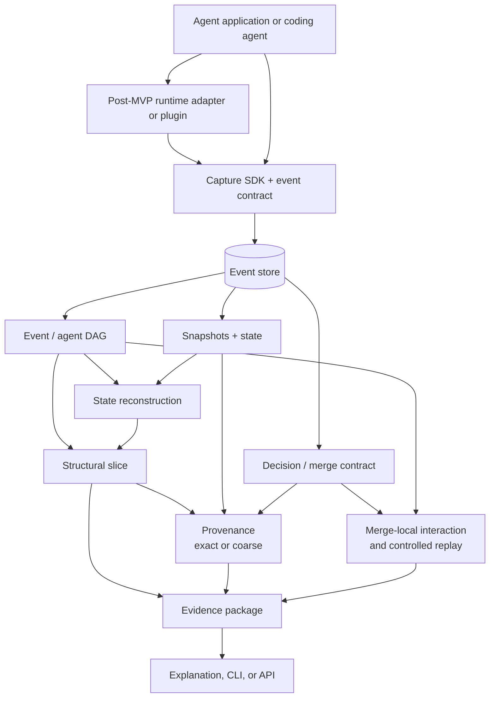
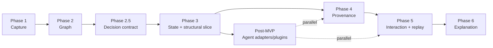

# Causal Debugging for Branching Multi-Agent Systems

## Changes from the previous version

This is a rewrite of the ChatGPT document, not a new document. Everything
that already worked is kept. The main changes are listed below, and each one
is marked inline with a **Changed** note at the spot it applies, so you can
find them without rereading the whole thing.

1. **Causal slicing was actually two different things wearing one name.**
   Walking backward through the graph to find everything reachable from a
   failure costs nothing, you just follow edges that already exist. Finding
   the smallest subset that still reproduces the failure means removing
   events and rerunning to check, which is a form of replay. The document
   called both of these "causal slicing" and put them in one phase. They
   are split now: a cheap structural slice ships early, and true
   minimization ships later, next to the machinery it actually depends on.

2. **Provenance was only ever shown working through deterministic code.**
   Every example traced a value through a tool call or a policy function.
   The moment a value passes through an LLM call, which is most of what an
   agent actually does, there is no reliable way to say which part of the
   input the model actually used to produce which part of the output. That
   is not a schema problem, it is the general interpretability problem, and
   it is worth being honest about in the design instead of finding it out
   during implementation.

3. **Interaction testing and minimal slicing both quietly need
   counterfactual replay**, even though the document introduces
   counterfactuals as a separate, optional, later feature. Testing whether
   `B3 + C3` together caused a failure means running the downstream steps
   more than one way. That is counterfactual replay by another name. These
   are grouped into one phase now instead of three sequential ones.

4. **The MVP was trimmed further.** Even the reduced MVP in the original
   still spanned six systems before a CLI existed. The new MVP is capture,
   the event and agent graph, state reconstruction, and the structural
   slice, nothing else, so `why A4` can return a real answer before
   anything harder gets built.

5. **The one sentence pitch was sharpened toward the specific claim that
   is actually defensible**, which is interaction attribution between
   independent agent branches, not causal debugging in general.

6. **The architecture became decision-centric.** The event graph remains
   the foundation, but declared dependency and tested decision influence
   are now separate concepts. A decision or merge contract sits above the
   event graph.

7. **Agent runtime integrations moved after the MVP.** Coding-agent
   adapters and plugins are a post-MVP distribution and dogfooding track,
   not a prerequisite for the core debugger.

8. **Implicit State and Environmental Flow Tracking (Resource-Version Invariants).**
   Shared memory, databases, and scratchpad files previously left unlinked
   causal gaps when agents communicated through mutations. Every stateful
   resource is now assigned a monotonic Resource Version Tuple
   `(version, last_writer_event_id)` that automatically injects causal edges
   on reads, guaranteeing DAG completeness.

9. **Semantic Counterfactual Ports for Decision Contracts (Phase 2.5).**
   Merge decisions are formalized as Structural Causal Models (SCMs) over
   typed semantic ports. Interventions execute true value substitutions
   `do(X_i = baseline)` rather than ad-hoc string deletions that cause prompt
   syntax collapse.

10. **Statistical Shapley-Owen Interaction Attribution.**
    Interaction testing is upgraded from a brittle Boolean 2x2 matrix to
    game-theoretic Shapley-Owen interaction indices with Monte Carlo
    confidence intervals, resolving the stochastic nondeterminism of LLMs.

11. **Empirical Context-Chunk Sensitivity for Provenance.**
    Coarse provenance at the LLM boundary is supplemented with post-mortem
    context-chunk masking, verifying empirical sensitivity without requiring
    internal model weights.

## Project thesis

Multi-agent AI systems are easy to trace and hard to debug.

A conventional trace tells us what happened.

```text
Planner -> Researcher -> Search
Planner -> Coder -> Code Tool
Planner -> Synthesizer -> Final Answer
```

The harder question is:

> **Why did the final answer become wrong?**

That question gets hard once multiple agents run independently, modify
state, call tools, and later merge their results into another agent's
decision. If a downstream step only fails when two upstream branches
combine in a particular way, a normal trace has no way to say so, since it
only ever shows you one branch at a time.

This project builds a causal debugger for branching and merging
multi-agent systems. It records agent execution as a graph of events and
dependencies, reconstructs historical state, traces values back to where
they came from where that is actually possible, and identifies whether a
failure came from one branch, from several independent branches, or
specifically from the interaction between branches.

> **Changed.** The original framed the headline idea as causal diagnosis
> in general. Interaction attribution, meaning telling `B3 alone` and
> `C3 alone` and `B3 combined with C3` apart, is the narrower and more
> specific claim, and it is the part that current causal debugging tools
> for agents are not doing yet. That belongs in the thesis itself, not
> buried in section 14.


# 1. Why this project exists

## 1.1 The original idea

The first version of this project was a time machine for agents. Record
every important event, save snapshots of state, let a developer move
backward and forward through a run, reconstruct the exact state at any
point, and compare states to understand failures.

That is useful, but it stopped being a strong enough thesis on its own
once several existing tools already offered checkpoint inspection, replay,
forking, and trace comparison for agents. So the project should not be
pitched as a debugger that lets you travel backward through execution.
Instead, the time travel machinery becomes the foundation underneath a
harder problem.

## 1.2 The new problem

The project asks:

> **How can we determine the causal structure of a failure when several
> agents execute independently and their outputs later converge into a
> shared decision?**

Consider this execution:

```text
                         Agent A
                         Planner
                            A1
                           /  \
                          /    \
                       spawn  spawn
                        /        \
                       v          v
               Agent B            Agent C
              Researcher            Coder
                  B1                  C1
                  |                   |
                  B2                  C2
                  |                   |
                  B3                  C3
                   \                 /
                    \               /
                     \             /
                      ----> A3 <---
                           |
                           v
                          A4
                       Final answer
```

A3 matters because it combines information from two independently
executing agents. If A4 is wrong, reading the timeline alone does not tell
us whether the problem came from B3 alone, C3 alone, both together, an
earlier state mutation that affected one of them, or an interaction
between two individually correct outputs. That is the problem worth
solving.


# 2. The core idea

The system turns an agent run into three related structures.

**Execution history.** What happened, in order.

```text
A1 -> A2 -> A3
```

**Causal graph.** Which events actually depended on which other events.

```text
B3 ----\
        >---- A3
C3 ----/
```

**State provenance.** Where a particular value came from.

```text
A3.customer_status
        |
        v
B3.output.customer_status
        |
        v
B2.tool_result
        |
        v
search(customer)
```

The debugger combines all three, so a developer can ask "why did A4 fail"
and get a causal slice back instead of a five hundred event trace.

# 3. A simple mental model

Assume four agents: A the planner, B the researcher, C the coder, and D a
final synthesizer.

```text
A: understand task
   |
   +----> B: research something
   |
   +----> C: write or inspect code
   |
   +----> D: combine results
```

B and C operate independently and form two branches:

```text
A -> B -> B1 -> B2 -> B3
 \
  \-> C -> C1 -> C2 -> C3
```

Later, A or D combines them:

```text
B3 ----\
        >---- D1 ----> final answer
C3 ----/
```

This is where debugging gets difficult. If the final answer is wrong, you
need to reason backward through multiple branches, not one list of steps.

---

# 4. The basic concepts

None of these are complicated once the picture is clear.

## 4.1 Event

An event is one thing that happened during execution: an LLM call, a tool
invocation, a tool result, a memory read or write, an agent spawning, an
agent finishing, a context change.

```json
{
  "id": "evt_42",
  "agent_id": "researcher",
  "type": "tool_result",
  "payload": {
    "tool": "search",
    "result": "..."
  }
}
```

An event is the smallest unit of history the debugger understands.

## 4.2 Event log

An event log stores these events as an append only history. Append only
means we never overwrite the past.

Think of a bank statement instead of a balance. A balance tells you what
you have right now. A statement tells you how you got there. Agent
debugging needs the statement, not just the current balance.

## 4.3 State

State is what an agent holds at a given moment: current context, memory,
retrieved documents, tool results, open tool calls, agent status, and any
other application state relevant to the run.

```json
{
  "context": ["..."],
  "memory": {
    "customer_status": "eligible"
  },
  "open_tools": []
}
```

## 4.4 Snapshot

A snapshot is a saved copy of state at one point in the run. Without
snapshots, reconstructing event 970 out of a thousand events could mean
replaying all 970. With a snapshot at event 950, you only replay the
twenty events after it. This is the same idea as a video keyframe.


# 5. Why a normal timeline is not enough

A normal trace looks like a numbered list of steps. It tells you what
happened. It does not tell you that step eight depended on steps four and
seven specifically. The debugger needs those relationships represented
explicitly, not implied by ordering.

---

# 6. The execution graph

There are four edge types.

**Same-agent edge.** An agent's next event followed its previous event.

```text
B1 -> B2 -> B3
```

**Spawn edge.** One agent created another.

```text
A1 - - -> B1
```

**Explicit causal dependency edge.** An event explicitly consumed information from another event.

```text
B3 ....> A3
C3 ....> A3
```

**Resource-versioned state edge.** An agent read a shared resource (memory key, file, DB record) mutated by an earlier event.

```text
B2 (write mem://status) ~~~~> C2 (read mem://status)
```

Explicit and resource-versioned edges are what allow multi-parent convergence. A3 can have more than one causal parent, and that is exactly why a simple tree structure is not enough.


# 7. Why this is a DAG

The causal structure is a directed acyclic graph, or DAG. Directed means
every relationship has a direction. Acyclic means the relationships never
loop back into an earlier event. One event can legitimately depend on
several earlier events at once:

```text
       B3
      /
     /
   A3
     \
      \
       C3
```

A single parent pointer cannot represent that. The data model needs
multiple causal parents per event.

---

# 8. Logical ordering

Two agents can run at the same time on different machines, so the event
that happened first can arrive in the database later. Wall clock time is
useful for humans reading a dashboard, but it should never determine the
causal graph.

Each event gets a logical sequence number instead, using a Lamport style
clock. When an event depends on another event, its position has to
respect that dependency.

> **The logical clock orders events. The dependency graph tells us what
> caused what.** The graph is the causal source of truth, always. Treat
> the sequence number as a way to find replay ranges and nothing more.

# 9. What the system records

The first version records five categories.

**Model interaction.** Model, input or context, output, token usage,
latency. The system does not need access to hidden chain of thought, only
the observable input, output, state, tools, and dependencies needed to
reproduce and explain behavior.

**Tool activity.** Tool name, arguments, invocation id, result, error,
retry information.

**Memory activity.** Reads, writes, deletes. A write should record a
change, meaning both the value before and after, since that is what lets
you find where an incorrect value first appeared.

**Context construction.** The actual context sent to the model matters on
its own, since memory can be correct while the assembled prompt is wrong.

**Lifecycle.** Run started, agent created, agent spawned, agent completed,
agent failed, run ended.


# 10. The event model

```text
Event
├── id
├── run_id
├── agent_id
├── logical_seq
├── wall_time
├── event_type
├── causal_parent_ids[]
├── payload
└── idempotency_key
```

`causal_parent_ids` holds the events whose information was used by this
event. For a merge event that would be `["B3", "C3"]`. `idempotency_key`
is a stable identifier used to avoid recording the same retry as a
duplicate event.

# 11. State reconstruction

To answer "what did Agent A know at A3," find the latest snapshot before
A3, load the events after that snapshot, apply them in logical order, and
return the resulting state.

```text
snapshot @ A0
      +
      A1
      +
      A2
      +
      A3
      ↓
state @ A3
```

This is the time travel part of the system. It matters, but it is not the
research contribution. It gives the causal layers above it a stable
historical state to reason about.

# 12. State provenance

Now add a second question: where did this value actually come from.

Suppose A3 contains `"customer_status": "eligible"`. The debugger should
be able to explain:

```text
A3.customer_status
    ↓
B3.output.customer_status
    ↓
B2.tool_result
    ↓
search(customer)
```

This works cleanly because every step in that chain is a tool call or a
direct field copy. That is not true in general.

> **Changed.** The original only ever showed provenance examples like the
> one above, all deterministic transforms and tool calls. The moment a
> value passes through an LLM call, provenance stops being exact. An LLM
> call takes in a whole assembled context and produces freeform text, and
> there is no reliable way to say which specific part of that input the
> model actually used to produce which specific part of the output. That
> is not something a better schema fixes, it is the open problem of model
> interpretability, and it does not have a general solution right now.
>
> So provenance in this system comes in three distinct tiers:
>
> - **Exact provenance.** Tool calls, memory reads and writes, direct
>   field copies, deterministic transforms. A field path traces cleanly
>   back to a specific upstream field.
> - **Coarse provenance.** Any value passing through an unverified LLM call.
>   The honest claim is "this assembled context window was the input to
>   this output," without pretending to know the internal weights.
> - **Empirical (chunk-verified) provenance.** When an LLM call is tested
>   post-mortem by localized context-chunk perturbation/masking. If masking
>   a specific upstream tool chunk flips the downstream output while masking
>   other chunks causes zero change, the link is empirically promoted with
>   measured sensitivity.

Provenance is valuable specifically because many agent failures are not
caused by the final reasoning step. The final step often just consumes a
value that was corrupted several steps earlier, and exact provenance is
what finds that corruption, when the corruption happened in code rather
than inside a model call.

# 13. Causal slicing

Suppose A4 is wrong and the full run has five hundred events. You do not
want to show the developer all five hundred.

> **Changed.** The original treated this as one phase using delta
> debugging throughout. That mixes two operations with very different
> costs. Splitting them makes the dependency on replay explicit instead of
> hidden inside a phase called "causal slicing."

## 13.1 Structural slice

Start from the failure and walk backward through `causal_parent_ids`.

```text
A4
 |
 v
A3
 / \
B3 C3
|   |
B2 C2
|   |
B1 C1
```

This costs nothing beyond graph traversal, since every edge already
exists in storage. No re-execution, no replay, no risk of nondeterminism.
This is cheap enough to run on every failure and should be the first
version of `why`.

## 13.2 Minimal slice

The structural slice can still contain events that are reachable but not
actually necessary. Finding the smallest subset that still reproduces the
failure means removing groups of events and checking whether the failure
explanation still holds, which means rerunning the downstream steps. That
is replay, and it belongs next to the counterfactual and interaction
testing machinery in section 16, not treated as a free operation.

Delta debugging is the right tool for this stage specifically: repeatedly
remove half the candidate events, check if the failure still reproduces,
and narrow down from there. It is a decades old, well established
technique for minimizing a failing test case, and there is no reason to
reinvent it.

# 14. The key research problem: interacting causes

This is the most important part of the project, and the part worth
leading with.

Consider two agents. B3 says `eligible = true`. C3 says
`high_risk = false`. A3 combines them: approve only if eligible and not
high risk. Now imagine B3 alone causes no failure, C3 alone causes no
failure, but B3 together with C3 causes a failure.

The failure is not well described as "B3 is the cause" or "C3 is the
cause." The interesting object is `B3 x C3`, an interaction between two
independently produced pieces of information. This is the specific shape
of multi-agent failure the system is built to expose, and it is the part
that existing causal debugging work for agents is not doing yet, since
most of it treats a failure as one linear chain rather than a convergence
of independent branches.

# 15. Why interaction effects matter

In a branching agent system, a final decision can depend on combinations
of upstream information in a few different shapes.

**One event is enough.** `B3 -> failure` regardless of C3.

**Either event is enough.** `B3 -> failure` and separately
`C3 -> failure`.

**Both are required.** `B3 + C3 -> failure`, neither alone.

**One event changes how another is interpreted.** B3 changes context such
that C3 only becomes harmful after B3 has already happened.

The debugger should tell these apart instead of treating every failure as
a single bad step.

# 16. Counterfactual debugging

Once a causal hypothesis exists, you want to test it. A counterfactual
asks what would have happened if one input had been different: B3
produces value X, leads to A3, leads to failure, versus B3 producing value
Y, leading to success instead. That is useful evidence, but it is not
automatically proof.

> **Changed.** The original introduced this as an optional, later
> feature, separate from causal slicing and interaction analysis. It
> is not separate. Section 13.2 (minimal slicing) and section 15
> (interaction testing) both need to rerun downstream steps under
> different conditions to answer their questions, which is exactly what
> counterfactual replay is. All three should be built as one phase,
> sharing one replay mechanism, rather than three phases that each quietly
> reinvent it.

## 16.1 Nondeterminism

LLMs are stochastic. Two executions can differ even with unchanged input,
so `run 1 -> failure, run 2 -> success` does not by itself prove that the
modified event caused the change in outcome. A serious implementation
controls what it can: fixed model version where possible, fixed tool
inputs, fixed retrieved data, fixed temperature or deterministic decoding
where the provider supports it, and repeated trials for anything that
stays stochastic no matter what you pin. Report evidence and a confidence
level, not certainty.

## 16.2 External side effects

Some operations should never simply be replayed: sending an email,
writing to a production database, charging a card, anything with a real
world effect. Counterfactual support should start with safe operations
only, meaning retrieval results, model outputs, pure computations, and
non mutating tools. Production mutations need a separate sandboxing design
before they can be part of this at all.

# 17. The first version of counterfactuals

Do not replay an entire production agent. Freeze the recorded execution
and intervene at one controlled point. Recorded: `B2.result = X`.
Intervention: `B2.result = Y`. Replay only what's downstream of that:
`B3 -> A3 -> A4`. Compare outcomes and report something like original
outcome failure, counterfactual outcome success, reproducible in eight out
of ten trials, evidence strong. This is a later stage feature, not
something the MVP needs.

# 18. The debugger workflow

```text
$ run inspect 7f42
```

```text
Agents
------
A  planner      completed
B  researcher   completed
C  coder        completed
```

```text
$ graph A4
```

```text
A1
├── B1 -> B2 -> B3 ──┐
└── C1 -> C2 -> C3 ──┼──> A3 -> A4
```

```text
$ slice A4
```

```text
Structural slice: 8 / 183 events

A1
B2
B3
C2
C3
A3
A4
```

```text
$ slice A4 --minimal
```

> **Changed.** Added this second command explicitly, so the cheap
> structural slice and the replay based minimal slice are two commands
> a user chooses between, not one command quietly doing expensive work
> every time it's called.

```text
$ provenance A3.customer_status
```

```text
A3.customer_status  (exact)
 <- B3.output.customer_status
 <- B2.tool_result
 <- search(customer)
```

```text
$ interactions A4
```

```text
Potential interaction:
B3 x C3

B3 alone: no failure
C3 alone: no failure
B3 + C3: failure
```

```text
$ explain A4
```

The explanation layer summarizes evidence the causal engine already
produced, it does not generate new claims of its own.

# 19. Architecture



The adapter/plugin boundary is optional during the MVP and becomes the
integration surface after Phase 3. The decision contract records which
branch outputs entered a decision; the replay layer tests which of those
inputs influenced its outcome.

The structural slice remains cheap graph traversal. Provenance and
interaction analysis consume its evidence, but neither is allowed to turn
declared dependency into a proven causal claim without the appropriate
evidence.

## Decision-centric debugging

The event graph is the foundation, but it should not be the primary user
concept. Developers do not ultimately want to inspect five hundred events;
they want to know why a decision was made.

The product models decisions as **Structural Causal Models (SCMs) over Semantic Input Ports**:

```text
Decision (SCM Formulation)
├── decision_id
├── decision_type
├── input_ports[]
│   ├── port_name (e.g. "eligibility_report", "risk_evaluation")
│   ├── source_event_id
│   ├── recorded_value
│   └── ablation_strategy (SENTINEL, CANONICAL, HISTORICAL_PRIOR)
├── output
├── policy_or_prompt_version
├── outcome
└── shapley_interaction_results
```

A decision can initially be represented as a typed merge event or a view
over existing events. The important change is semantic:
the system should answer `why decision D123?`, not only `show ancestors of
event A4`.

The system distinguishes three relationships:

```text
Execution relationship: what happened before what?
Data dependency: which outputs were passed into this event?
Decision influence: which inputs changed the outcome?
```

`causal_parent_ids` records declared dependency. Influence is tested
separately by executing typed counterfactual substitutions on semantic ports:
`do(Port_i = baseline_value)` rather than dropping text from prompts.

## Efficient interaction attribution

Full-run replay is expensive, nondeterministic, and unsafe around external
side effects. The first interaction analysis should therefore be
merge-local.

At a merge point where B and C feed a downstream decision, freeze the
recorded outputs of B and C and replay only the merge and its downstream
decision function over semantic port interventions:

1. **Individual Branch Influence (Shapley Value $\phi_i$):**
   Measures the marginal contribution of branch $i$ across all possible subsets of active parent branches.
2. **Pairwise Interaction Index ($I_{ij}$):**
   Measures non-linear joint dependency between branches $i$ and $j$:
   $$I_{ij} = \sum_{S \subseteq N \setminus \{i, j\}} \frac{|S|!(|N| - |S| - 2)!}{|N|! - 1} \left[ v(S \cup \{i, j\}) - v(S \cup \{i\}) - v(S \cup \{j\}) + v(S) \right]$$
3. **Statistical Confidence Intervals:**
   Because LLM outputs can be stochastic, $v(S) = P(\text{Failure} \mid S)$ is estimated via Monte Carlo replay trials per subset, reporting standard errors ($I_{BC} \pm \sigma$) and $p$-values.

This classifies the causes with statistical confidence:
- $\phi_B \gg 0, I_{BC} \approx 0$: B alone is sufficient.
- $\phi_C \gg 0, I_{BC} \approx 0$: C alone is sufficient.
- $I_{BC} \gg 0$: B and C interact jointly.
- $\phi_B \approx 0, \phi_C \approx 0, I_{BC} \approx 0$: Neither implicated.

This is both more efficient and scientifically rigorous under temperature noise than a brittle Boolean 2x2 matrix.

## Strategic direction

The project should use coding agents as a practical dogfooding environment
and decision attribution as the general core. A coding task can be modeled
as a decision whose evidence includes model outputs, shell commands, file
edits, tests, and subagent reports. The same abstraction then applies to
risk allocation, underwriting, incident diagnosis, moderation, medical
decision support, and supply-chain planning.

The strongest evaluation is not storage throughput alone. It is whether a
known failure involving two converging branches is correctly classified as
an interaction, while ordinary tracing or a single-cause debugger blames
one branch.

The project should deliberately avoid a graph database, a large dashboard,
many integrations, automatic repair, exact provenance through an LLM, and
unrestricted production replay until the benchmark demonstrates that they
are needed.

# 20. MVP

> **Changed.** Trimmed further than the original. Provenance, minimal
> slicing, interaction analysis, and counterfactuals are all pushed to a
> second milestone. The goal of the MVP is narrower: prove the structural
> `why` command works end to end on a real multi-agent run.

The implementation of the MVP spans Phases 1 through 3. Phase 2.5 is a
small contract-hardening step between the graph and replay work; it does
not expand the MVP into interaction analysis or full counterfactual replay.

## Goal

Prove that a real multi-agent run can be captured, turned into a graph,
and queried for a structural causal slice from a single command.

## MVP features

1. **Event capture.** Model calls, tool calls, tool results, memory
   changes, agent lifecycle, cross-agent dependencies.
2. **Event graph.** The multi-agent DAG.
3. **State reconstruction.** Recover state at an arbitrary event.
4. **Structural causal slice.** Given a failure event, return everything
   reachable through `causal_parent_ids`.
5. **CLI.** `agents`, `graph`, `state`, `slice`.

That is enough for the first milestone.

# 21. What is deliberately NOT in the MVP

```text
full web dashboard
cloud SaaS
large integration catalog
automatic repair
field level provenance
minimal slicing (delta debugging)
interaction analysis
counterfactual replay
LLM generated diagnosis as the primary feature
unrestricted replay of production side effects
```

> **Changed.** Provenance, minimal slicing, interaction analysis, and
> counterfactuals moved into this excluded list, since they were folded
> out of the MVP in the change above.

# 22. Implementation order

> **Changed.** Reordered so the structural slice ships early, next to
> replay, since it costs nothing beyond a graph traversal. Minimal
> slicing, interaction analysis, and counterfactuals are merged into one
> phase, since they share the same replay dependency instead of being
> three separate phases that each build it again.



## Phase 1: Capture

Input: a small multi-agent application. Output: a correct event log. Main
risk: missing or incorrectly linked events.

## Phase 2: Graph

Input: recorded events and dependency metadata. Output: agent graph and
event DAG. Main risk: incorrect cross-agent dependencies.

## Phase 2.5: Decision contract

Input: the Phase 2 event graph. Output: an explicit contract for decision
and merge events, including which branch outputs were supplied to the
decision. Main risk: confusing declared dependency with proven decision
influence.

This phase remains inside MVP hardening. It does not replay upstream model
calls or claim that every declared parent changed the outcome.

## Phase 3: State reconstruction and structural slice

Input: event log and snapshots. Output: historical state reconstruction,
plus a structural causal slice from any failure event. Main risk:
reconstructed state differs from the original recorded state.

Phase 3 completes the MVP. It provides the historical state and structural
evidence that later provenance and interaction analysis consume.

## Post-MVP: Agent runtime adapters and plugins

Input: the completed Phase 3 MVP and its stable event/decision contract.
Output: vendor-neutral runtime adapters and plugins that capture real coding
agent sessions and send them through the same core pipeline. This track starts
after Phase 3 and may run in parallel with Phases 4 and 5; it is a distribution
and dogfooding track, not a prerequisite for the core debugger.

## Phase 4: Provenance

Input: state and causal graph. Output: origin chain for selected values,
marked exact or coarse. Main risk: presenting a coarse, LLM mediated link
with the same confidence as an exact one. Provenance should be especially
useful for tracing the inputs that entered a decision, while remaining
honest about the limits of field-level attribution through an LLM.

## Phase 5: Minimal slicing, interaction analysis, and counterfactuals

Input: a replayable structural slice and a decision/merge contract. Output:
merge-local interaction attribution first, followed by minimal slicing and
broader controlled replay where necessary. Main risk: nondeterminism or
external side effects making an experiment inconclusive, and blaming one
branch when the real cause is a combination of branches.

The efficient first step is to freeze recorded branch outputs and replay
only the downstream merge. Test both branches, each branch alone, and
neither branch. Full-run replay is a fallback for cases that cannot be
resolved at the merge boundary, not the default path.

## Phase 6: Explanation

Input: structural evidence, provenance, and whatever phase 5 produced.
Output: a human readable diagnosis. Main risk: the explanation claims more
than the underlying evidence actually supports.

# 23. Benchmark

The benchmark should test the actual problem, not a generic "trace viewer
is easier to read" claim.

**Benchmark 1, single cause.** `B2 -> failure`. Expected result: `B2`.

**Benchmark 2, multiple parents.** `B3 + C3 -> failure`. Expected result:
`B3, C3`.

**Benchmark 3, interaction.** B3 alone passes, C3 alone passes, B3 with C3
fails. Expected result: `B3 x C3`.

**Benchmark 4, distractor branches.** Relevant branches B and C,
irrelevant branches D, E, F, G. Expected result: a small causal slice that
excludes the irrelevant branches.

**Benchmark 5, memory contamination.** B writes an incorrect value, C
reads it, A consumes C's result, failure. Expected result: `B.memory_write`
plus the downstream dependency chain.

# 24. Metrics

**Root cause accuracy.** Did the system identify the correct event or
interaction.

**Causal slice size.** How many events remained after reduction.

**Irrelevant event reduction.** How much of the original run was removed
without losing the explanation.

**Interaction attribution accuracy.** Can the system identify `B3 x C3`
instead of incorrectly blaming B3 or C3 alone.

**Human diagnosis time.** How quickly a developer finds the correct cause
with this system compared with an existing trace or replay workflow.

> **Changed.** Added one more: **provenance grade accuracy**, meaning how
> often the system correctly labels a link as exact versus coarse rather
> than presenting a coarse, LLM mediated guess as if it were exact. Given
> the caveat in section 12, this matters as much as root cause accuracy
> for whether the tool can actually be trusted.

A benchmark should compare against a real existing tool rather than only
a raw flat log.

# 25. Technical decisions for the first implementation

```text
Language: Python
Storage: PostgreSQL
CLI: Typer
Graph representation: NetworkX initially
Tests: pytest

Agent integration:
start with one model SDK and one simple agent framework
```

Do not introduce a graph database unless measurement proves recursive
graph queries are an actual bottleneck. The hard part is not storing nodes
and edges, it is defining correct dependencies and reconstructing state
consistently.

# 26. What is actually novel

> **Changed.** Tightened to name the specific gap rather than describing
> the project's scope in general terms.

The project should not claim that nobody has built causal debugging for
AI agents, since that would be too broad and, based on a check of current
tools and research, it would also not be true. What is genuinely narrow
and still open is this: existing causal and counterfactual debugging work
for agents, published research included, treats a failure as a single
linear trajectory and intervenes on one step at a time. None of it is
built for the case where a failure only appears once two independently
executing branches converge, and where the interesting object is the
interaction between them rather than either branch alone.

The narrower claim is:

> This project studies causal debugging for branching and merging
> multi-agent executions, where independent agent branches produce
> information that later converges into a shared decision. It combines
> event level causal dependencies, historical state reconstruction, field
> level provenance where that is actually possible, structural and
> minimal causal slicing, and interaction analysis between branches into
> one debugging model.

The project is only interesting if the implementation and benchmark show
this model actually resolves failure cases that are hard to diagnose with
ordinary replay and trace tools. The novelty has to be shown empirically,
not asserted.

# 27. What success looks like

A developer has a failed run with five hundred events. Instead of
searching the trace by hand, they run `why A4` and get back something
like this.

```text
Failure: A4

Original run:
500 events

Structural slice:
11 events

Direct decision point:
A3

Merged dependencies:
B3
C3

Important state:
A3.customer_status

Provenance:
A3.customer_status (exact)
 <- B3.output.customer_status
 <- B2.tool_result
 <- external search

Interaction candidate:
B3 x C3

Counterfactual status:
not attempted
reason: one upstream operation has an external side effect
```

The developer now has a concrete place to look and a machine readable
account of how information flowed into the failure. That is the product.
It is not a prettier trace viewer.

# 28. Final project statement

> **Changed.** Both versions below are tightened to lead with interaction
> attribution specifically, instead of causal diagnosis broadly.

**One sentence version.**

> A causal debugger for multi-agent systems that tells you whether a
> failure came from one branch, from several independent branches, or
> specifically from the interaction between branches that converge into a
> shared decision.

**Longer version.**

> Modern agent observability tools can show what an agent did, and replay
> systems can reconstruct earlier execution states. The harder problem
> shows up once multiple agents run concurrently and later merge their
> outputs. A downstream failure can depend on several upstream events,
> state mutations, and cross-agent interactions, and existing causal
> debugging approaches for agents mostly treat a failure as one linear
> chain rather than a convergence of independent branches. This project
> builds a causal execution model for branching multi-agent systems: an
> event and dependency DAG with historical state reconstruction, provenance
> that is exact where the data path is deterministic and explicitly marked
> coarse where it passes through a model call, a cheap structural slice for
> everyday use, and a minimal slice with interaction attribution for cases
> that need it. Given a failure, the system determines whether it came from
> an individual event, multiple independent causes, or an interaction
> between branches, and it can verify a hypothesis through safe,
> controlled counterfactual replay. The project is evaluated on controlled
> multi-agent failure scenarios, with particular emphasis on cross-agent
> interactions and convergence points, benchmarked against a real existing
> tool rather than a flat log.

# 29. The simplest way to think about the entire system

```text
1. RECORD
   What happened?

2. CONNECT
   Which events depended on which others?

3. RECONSTRUCT
   What state existed at that point?

4. TRACE BACK
   Where did each important value come from, and how confidently?

5. EXPLAIN CAUSALITY
   Which events or interactions actually matter to the failure?
```

Everything else is implementation detail.

# 30. Technical deep dive

This section is the how, matching the phases above exactly. Where a
design decision is genuinely open rather than settled, it says so, rather
than papering over it with clean sounding code.

## 30.1 Schema

```sql
create table runs (
  id            uuid primary key default gen_random_uuid(),
  name          text,
  started_at    timestamptz not null default now(),
  ended_at      timestamptz,
  metadata      jsonb not null default '{}'
);

create table agents (
  id                   uuid primary key default gen_random_uuid(),
  run_id               uuid not null references runs(id),
  parent_agent_id      uuid references agents(id),
  spawned_at_event_id  uuid,
  role                 text,
  status               text not null default 'active',
  lamport_offset       bigint not null default 0,
  created_at           timestamptz not null default now()
);

create type event_type as enum (
  'model_call', 'tool_call', 'tool_result',
  'memory_read', 'memory_write', 'context_update',
  'agent_spawn', 'agent_finish', 'agent_error',
  'run_start', 'run_finish'
);

create table events (
  id                uuid primary key default gen_random_uuid(),
  run_id            uuid not null references runs(id),
  agent_id          uuid not null references agents(id),
  logical_seq       bigint not null,
  wall_time         timestamptz not null default now(),
  event_type        event_type not null,
  causal_parent_ids uuid[] not null default '{}',
  payload           jsonb not null,
  idempotency_key   text,
  created_at        timestamptz not null default now()
);

alter table agents
  add constraint fk_spawned_at_event
  foreign key (spawned_at_event_id) references events(id);

create table snapshots (
  id           uuid primary key default gen_random_uuid(),
  run_id       uuid not null references runs(id),
  agent_id     uuid not null references agents(id),
  logical_seq  bigint not null,
  state        jsonb not null,
  state_hash   text not null,
  created_at   timestamptz not null default now()
);

create index idx_events_agent_seq on events (agent_id, logical_seq);
create index idx_events_run_seq   on events (run_id, logical_seq);
create index idx_snapshots_agent_seq on snapshots (agent_id, logical_seq desc);
create unique index idx_events_idempotency on events (agent_id, idempotency_key) where idempotency_key is not null;
```

Start with `causal_parent_ids` as a plain array for the MVP, since it is
simple and needs no extra writes. Once phase 5 is doing enough recursive
graph queries that the array starts to feel slow, add a mirrored edge
table populated by a trigger, rather than changing every write path at
once:

```sql
create table causal_edges (
  parent_event_id uuid not null references events(id),
  child_event_id  uuid not null references events(id),
  primary key (parent_event_id, child_event_id)
);

create index idx_causal_edges_child on causal_edges (child_event_id);
```

Provenance is new for this version of the document and gets its own
table, since it needs to carry the exact versus coarse distinction from
section 12 as data, not as a comment:

```sql
create type provenance_grade as enum ('exact', 'coarse');

create table provenance_edges (
  id               uuid primary key default gen_random_uuid(),
  run_id           uuid not null references runs(id),
  field_path       text not null,
  source_event_id  uuid not null references events(id),
  source_path      text,
  grade            provenance_grade not null,
  transform        text,
  created_at       timestamptz not null default now()
);

create index idx_provenance_field  on provenance_edges (run_id, field_path);
create index idx_provenance_source on provenance_edges (source_event_id);
```

`source_path` is null exactly when `grade` is `coarse`, since a coarse
link has nowhere further to point. That is not an edge case to handle
later, it is the schema making the honesty from section 12 structural,
so a query that walks the chain simply stops at the LLM boundary instead
of pretending to trace through it.

## 30.2 Logical clock

Same Lamport style clock as before, seeded from the parent agent's
counter at spawn time. The rule stays: `new_seq = max(local_counter,
max(causal_parent_seqs)) + 1`. The sequence number orders events and finds
replay ranges. It never establishes causality by itself, that is what
`causal_parent_ids` is for.

```python
def next_seq(agent_state: AgentClock, causal_parents: list[int]) -> int:
    agent_state.counter = max(agent_state.counter, *causal_parents, default=agent_state.counter) + 1
    return agent_state.counter
```

## 30.3 State reconstruction

Find the nearest snapshot at or before the target, replay forward:

```sql
select * from snapshots
where agent_id = $1 and logical_seq <= $2
order by logical_seq desc
limit 1;

select * from events
where agent_id = $1
  and logical_seq > coalesce($3, 0)
  and logical_seq <= $2
order by logical_seq asc;
```

```python
def reduce(state: AgentState, event: Event) -> AgentState:
    match event.event_type:
        case "memory_write":
            apply_memory_diff(state.memory, event.payload)
        case "tool_call":
            state.open_tools.add(event.id)
        case "tool_result":
            state.open_tools.discard(event.payload["invocation_id"])
        case "context_update":
            state.context = event.payload["context"]
        case "agent_finish":
            state.status = "completed"
    return state

def reconstruct(agent_id, target_seq):
    snap = latest_snapshot_before(agent_id, target_seq)
    state = snap.state if snap else AgentState.empty()
    events = fetch_events(agent_id, since=snap.logical_seq if snap else 0, until=target_seq)
    return functools.reduce(reduce, events, state)
```

At snapshot time, store a hash of the state, so a later reconstruction can
be checked against it rather than trusted blindly:

```python
state_hash = hashlib.sha256(canonical_json(state).encode()).hexdigest()
assert reconstructed_hash == snapshot.state_hash, "replay integrity error"
```

## 30.4 Structural slice

This is the cheap half of section 13, pure graph traversal, no
replay, no execution:

```python
def structural_slice(event_id: str) -> set[str]:
    visited = set()
    queue = [event_id]
    while queue:
        current = queue.pop()
        if current in visited:
            continue
        visited.add(current)
        event = fetch_event(current)
        queue.extend(event.causal_parent_ids)
    return visited
```

The same thing as one recursive query, useful once the array grows large
enough that doing this in application code gets slow:

```sql
with recursive ancestors as (
  select id, causal_parent_ids from events where id = $1
  union
  select e.id, e.causal_parent_ids
  from events e
  join ancestors a on e.id = any(a.causal_parent_ids)
)
select distinct id from ancestors;
```

Complexity is O(V + E) over the reachable subgraph. Safe to run on every
failure, including in production, since nothing gets re-executed.

## 30.5 Minimal slice, delta debugging

This is the expensive half of section 13.2, and it depends on a working
`test_fn` that can answer whether the failure still reproduces with only
a given subset of events present. That function is the counterfactual
replay engine from section 30.7, called here rather than reimplemented.

```python
def ddmin(candidate_events: list[str], test_fn) -> list[str]:
    n = 2
    current = candidate_events
    while len(current) >= 2:
        chunk_size = max(1, len(current) // n)
        chunks = [current[i:i + chunk_size] for i in range(0, len(current), chunk_size)]
        reduced = False
        for chunk in chunks:
            complement = [e for e in current if e not in chunk]
            if test_fn(complement):
                current = complement
                n = max(n - 1, 2)
                reduced = True
                break
        if not reduced:
            if n == len(current):
                break
            n = min(n * 2, len(current))
    return current
```

`test_fn(subset)` should return true if replaying with only `subset`
present still reproduces the failure. Each call is a full downstream
replay, so this is not free, and it should be scoped, not run on the
whole structural slice by default. Two practical guards worth building in
from the start rather than adding later: cache `test_fn` results keyed by
the subset, since ddmin calls it on overlapping subsets repeatedly, and
cap the total number of replay calls per minimization run, falling back
to returning the structural slice unminimized if the budget runs out
instead of hanging.

## 30.6 Interaction testing

Restrict candidates to the direct causal parent ports of a decision or merge
event. Interventions are formulated as typed counterfactual baseline
substitutions rather than deleting prompt text:

```python
@dataclass(frozen=True)
class DecisionPort:
    port_id: str
    source_event_id: str
    field_path: str
    recorded_value: Any
    baseline_value: Any  # SENTINEL, CANONICAL, or HISTORICAL_PRIOR

def compute_shapley_interaction(decision_id: str, ports: list[DecisionPort], evaluate_fn, samples_per_cell: int = 5) -> dict[str, Any]:
    """Compute individual Shapley values and pairwise Shapley-Owen Interaction Indices
    over Monte Carlo counterfactual replay evaluations."""
    port_ids = [p.port_id for p in ports]
    n = len(port_ids)

    # Evaluate characteristic function v(S) = P(failure | active subset S)
    # S contains active ports; excluded ports receive their baseline_value
    def v(subset: frozenset[str]) -> float:
        fails = 0
        for _ in range(samples_per_cell):
            outcome = evaluate_fn(active_ports=subset)
            if outcome == "failure":
                fails += 1
        return fails / samples_per_cell

    # Pairwise Interaction Index for (a, b)
    results = {}
    for i, a in enumerate(port_ids):
        for b in port_ids[i+1:]:
            rest = [p for p in port_ids if p not in (a, b)]
            interaction_sum = 0.0
            # Iterate over subsets of remaining ports
            for r in range(len(rest) + 1):
                for subset in itertools.combinations(rest, r):
                    s = frozenset(subset)
                    weight = math.factorial(len(s)) * math.factorial(n - len(s) - 2) / (math.factorial(n) - 1)
                    delta2 = v(s | {a, b}) - v(s | {a}) - v(s | {b}) + v(s)
                    interaction_sum += weight * delta2
            results[f"{a}_x_{b}"] = interaction_sum

    return results
```

This replaces ad-hoc Boolean checks with game-theoretic interaction values bounded by statistical confidence intervals.

## 30.7 Counterfactual replay engine

This is what both `ddmin` and interaction analysis call into. It replays
downstream of an intervention using recorded outputs and semantic port
substitutions wherever possible, and refuses outright on anything side effecting:

```python
@dataclass
class PortIntervention:
    port_id: str
    substitute_value: Any

SIDE_EFFECTING = {"database_write", "email_send", "payment", "external_api_mutation"}

def counterfactual_replay(
    run_id: str,
    decision_id: str,
    interventions: list[PortIntervention],
    mode: str = "recorded_output",
) -> str:
    decision = fetch_decision(decision_id)
    # Apply port overrides to decision input payload
    eval_inputs = dict(decision.recorded_inputs)
    for inter in interventions:
        eval_inputs[inter.port_id] = inter.substitute_value

    if decision.is_side_effecting:
        raise ReplayUnsafe(f"Decision {decision_id} contains un-sandboxed side effects")

    return decision.evaluate(eval_inputs)
```

The three replay modes from section 16 map directly onto this. Recorded
output replay with Semantic Port substitution is the default and safe path.

## 30.8 Provenance capture and empirical verification

Exact provenance gets written at the moment a tool result or memory write
is captured, since those events carry an explicit field level source:

```python
def record_tool_result_provenance(event, field_sources: dict[str, str]):
    for field, source_path in field_sources.items():
        insert_provenance(
            run_id=event.run_id,
            field_path=f"{event.agent_id}.{field}",
            source_event_id=event.id,
            source_path=source_path,
            grade="exact",
        )
```

Coarse provenance gets written for anything downstream of a model call:

```python
def record_model_call_provenance(event, downstream_field_paths: list[str]):
    for field_path in downstream_field_paths:
        insert_provenance(
            run_id=event.run_id,
            field_path=field_path,
            source_event_id=event.id,
            source_path=None,
            grade="coarse",
        )
```

For post-mortem deep debugging, **Context-Chunk Sensitivity Verification**
masks individual input chunks in the prompt:

```python
def verify_chunk_sensitivity(model_event, chunk_id: str, evaluate_fn) -> float:
    """Mask chunk_id with a neutral baseline and measure semantic output shift."""
    masked_prompt = mask_context_chunk(model_event.payload["input"], chunk_id)
    original_output = model_event.payload["output"]
    perturbed_output = evaluate_fn(masked_prompt)
    return semantic_distance(original_output, perturbed_output)
```

If sensitivity exceeds a significance threshold, the provenance link is
empirically promoted to **verified chunk-level provenance**.

## 30.9 Edge cases worth designing for early

**Disconnected shared-state channel (Memory/File concurrency).** If Agent B
writes to shared memory and Agent C reads it, the SDK's Resource Version
Registry automatically binds C's read event to B's write event as a causal
parent, preventing disconnected causal subgraphs.

**Intra-agent timeline continuity.** The capture wrappers in `sdk/tools.py`
and `sdk/client.py` auto-chain an agent's consecutive events so that
ancestor traversal does not drop intermediate reasoning steps.

**Prompt syntax collapse on intervention.** Semantic Port substitutions
`do(X_i = baseline_value)` preserve prompt template formatting, avoiding
spurious failures caused by unescaped nulls or empty tokens.

**Out of order ingestion.** An async tool call can return after a later
reasoning step already logged. `logical_seq` is the source of truth for
ordering, not arrival time, and the capture SDK allocates the sequence
number before the event leaves the process using per-agent locks or
`FOR UPDATE` database row locks.

**Retried tool calls.** The idempotency unique index on
`(agent_id, idempotency_key)` makes a retry a no-op insert, so it cannot
create a duplicate causal edge or get double counted by the reducer.

**Delta debugging cost blowing up.** Cache `test_fn` results and cap total
replay calls per minimization run.

**Long running agents and storage growth.** Keep every snapshot from the
last day, keep every tenth snapshot older than that, drop the rest. Keep
events indefinitely; only prune large snapshot blobs.
